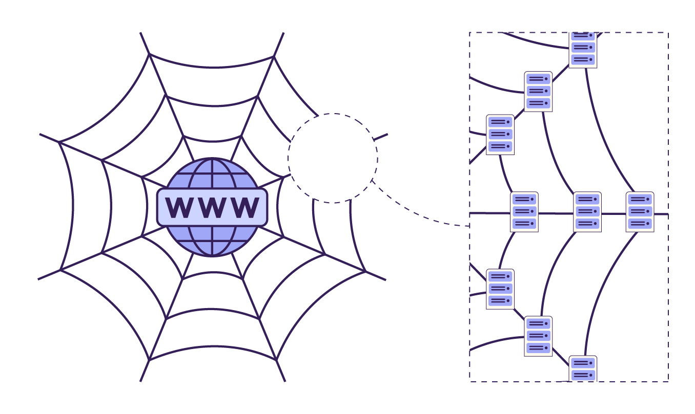
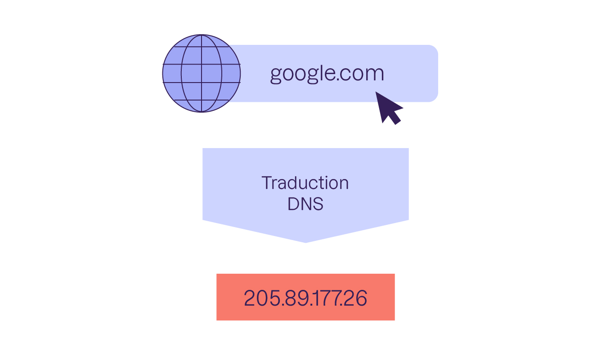
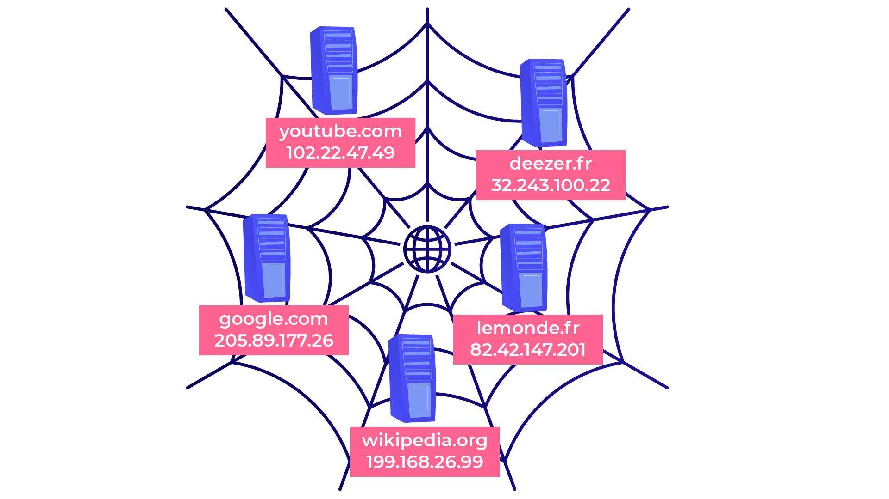

#BTS #1A #SISR

# Introduction

Naviguer sur le **web** évoque souvent l'image d'un **surfeur** se déplaçant d'une vague à l'autre. Chaque **clic** nous amène vers une nouvelle **page** ou découverte.

Une autre analogie courante est celle d'une **toile d'araignée**, reflétant bien le terme anglais « **web** » qui signifie **toile**. Cette image représente parfaitement le réseau complexe de **pages** et de **liens** qui constituent le **web**. 🕷

Un petit peu d'histoire ? 🙂

- 1969 : création de l’ancêtre d’Internet, appelé alors **ARPAnet**. C’est un réseau militaire qui se veut décentralisé (autrement dit, il n’a pas de lieu de commande central). Le réseau a ensuite évolué pour devenir un lieu d’échange universitaire avant de devenir progressivement grand public sous le nom d’Internet.

- 1972 : apparition des **e-mails** pour échanger des messages.

- 1991 : lancement du **Web** public, pour afficher des pages d’information, créé par Tim Berners-Lee. C’est à ce moment que la notion de « pages web » et de « liens hypertextes » (permettant de naviguer entre chaque page) apparaît. C’est la naissance de la toile !

- 1994 : création du [W3C](https://www.w3.org/) (World Wide Web Consortium), organisme qui a pris le relais de Tim Berners-Lee pour faire évoluer les technologies du web (HTML, CSS, PNG, XML et autres noms barbares).

## Internet, Web, Cloud ?

On confond souvent Internet et le Web. Or, **Internet a été inventé avant le Web.** On peut voir le Web comme un service _à l’intérieur_ d’Internet.

L'**Internet** est le réseau permettant la communication entre ordinateurs, offrant divers services :

- **Le Web** : le plus célèbre, accessible via des navigateurs tels que Google Chrome, Firefox, Internet Explorer, Edge, Safari.
- **Les e-mails** : pour l'échange de messages électroniques.
- **Le FTP** : utilisé pour le transfert de fichiers entre ordinateurs.
- Etc.

Il est courant de confondre le Web avec les autres services, bien que ceux-ci tendent à être intégrés au Web. Par exemple, l'accès aux e-mails, autrefois exclusif aux logiciels dédiés comme Mozilla Thunderbird, Apple Mail, Outlook, se fait maintenant majoritairement via le Web, à travers des sites comme Gmail.

Ainsi, le Web agit comme point d'accès principal pour de nombreux services actuels.

### Cloud ⛅

Le **Cloud** est une métaphore pour désigner le stockage et l'accès à des données et services via internet, plutôt que sur votre ordinateur local. Imaginez-le comme un nuage capable de stocker de l'information et de la rendre accessible de n'importe où, à condition d'avoir une connexion internet. Cela permet une grande flexibilité, comme l'expansion de l'espace de stockage selon vos besoins, rappelant la nature changeante d'un nuage.

Les services **Cloud** sont accessibles via une interface web, et incluent des applications quotidiennes telles que :

- **Services d'email** : Gmail, Outlook, etc.
- **Stockage de documents** : Dropbox, Google Drive, etc.
- **Messagerie** : Slack, Discord, Messenger, etc.

Ces services, sont regroupés sous le terme de **Cloud**.

Il existe différents types de cloud, mais le plus commun pour le grand public est le **SaaS** (*Software as a Service*), qui désigne l'utilisation de logiciels via une interface web.

## Les serveurs

Dans cette nouvelle partie, nous allons nous intéresser plus précisément au **réseau** lui-même. Le réseau est ce qui permet aux ordinateurs de communiquer entre eux !

Pour commencer, je vous rappelle que l’on se représente souvent une toile d’araignée pour désigner le **Web**. En effet, les ordinateurs communiquent entre eux via des nœuds :

### Comment communiquent-ils ?

Il est essentiel que les **serveurs** et les **clients** puissent échanger des données. Cette communication s'effectue via des **câbles réseau** connectés à l'arrière des serveurs, qui sont à leur tour reliés à un **câble de fibre optique**. Cette connexion permet une transmission de données à très haute vitesse. La **fibre optique** est souvent installée sous terre, mais elle traverse également les océans, enfouie au fond de la mer. En réalité, une grande partie du **trafic Internet** mondial circule à travers ces **câbles sous-marins**.

Lorsque vous accédez à un **site web** hébergé aux **États-Unis** depuis la **France**, il est très probable que votre connexion passe par des **câbles sous-marins** dans l'océan Atlantique. Si ces câbles venaient à être coupés, une situation qui peut se produire, le **trafic Internet** serait automatiquement redirigé via d'autres câbles, même si cela signifie emprunter un trajet plus long. C'est ainsi que fonctionne l'Internet, capable de trouver des **itinéraires alternatifs** de manière autonome.

Cependant, pour des raisons de performance, il est préférable que les **serveurs** soient situés au plus près des **utilisateurs**. Ainsi, même si vous pouvez accéder à des données situées aux États-Unis depuis la France, le temps de réponse sera légèrement plus long, de l'ordre de quelques **millisecondes**. Pour une expérience utilisateur optimale, la proximité des serveurs est donc essentielle, car même un léger délai est considéré comme inacceptable pour certains utilisateurs impatients.

## IP et DNS

Comment peut-on localiser un ordinateur n'importe où sur la planète ? C'est une question intéressante, n'est-ce pas ? 🤔

Par exemple, lorsque vous souhaitez accéder à Google, comment votre ordinateur parvient-il à identifier le serveur approprié parmi tous ceux disponibles ?

### Adresse IP

Chaque ordinateur possède une **adresse**. On parle d’**adresse IP**. Il s’agit d’une suite de nombres comme **205.89.177.26**. Vous pouvez voir cela comme une sorte de numéro de téléphone.

En théorie donc, vous pouvez aller sur un site web en tapant directement l’adresse du serveur dans votre barre d’adresse.

### DNS

DNS signifie 'Domaine Name System' en anglais, en français on peut dire système de noms de domaine.

On a donc créé des noms d’hôte, comme "google.com", pour pouvoir se souvenir plus facilement du nom du service que l’on veut contacter.

Et l’on a ensuite créé un service d’annuaire, les **DNS**, pour faire le lien entre le nom d’hôte et l’**adresse IP** :

Le **DNS** sert à convertir les noms d’hôte en adresses IP. Il agit comme un immense annuaire qui répertorie tous les noms d’hôtes (comme **google.com**, **youtube.com**) et leur adresse IP correspondante.

Heureusement, tout cela fonctionne automatiquement, sans que nous ayons à y penser. Lorsqu'on entre "google.com" dans notre navigateur, le site web apparaît sans effort de notre part !

## Les Protocoles

Dans le monde des **réseaux informatiques**, les machines communiquent entre elles grâce à des règles et des conventions spécifiques, connues sous le nom de **protocoles**. Ces protocoles sont essentiels pour l'échange d'informations sur Internet et peuvent être classés en deux catégories principales : les protocoles de **bas niveau** et les **protocoles de haut niveau**.

### Protocoles Bas Niveau

Les protocoles de **bas niveau** forment la fondation sur laquelle repose Internet. Ils sont omniprésents dans toutes les communications réseau. Deux des protocoles de bas niveau les plus importants sont :

- **TCP (Transmission Control Protocol)** : Inventé par Vint Cerf, TCP est crucial pour la communication réseau. Il permet la transmission fiable de données entre les ordinateurs sur un réseau. TCP est utilisé pour de nombreuses applications, y compris le transfert de pages web, d'e-mails et de vidéos.

- **UDP (User Datagram Protocol)** : Contrairement à TCP, UDP est utilisé pour les transmissions de données qui ne nécessitent pas d'accusé de réception, ce qui le rend plus rapide mais moins fiable. UDP est souvent utilisé pour les jeux en ligne et la diffusion de vidéos en streaming.

### Protocoles Haut Niveau

Les protocoles de haut niveau sont construits sur les protocoles de bas niveau comme TCP et UDP. Ils fournissent des fonctionnalités spécifiques pour diverses applications sur Internet. Voici quelques exemples de protocoles de haut niveau :

- **HTTP (Hypertext Transfer Protocol)** : Développé par Tim Berners-Lee, HTTP est le protocole utilisé pour échanger des pages web. Il fonctionne comme une requête-réponse entre le client et le serveur.

- **HTTPS (HTTP Secure)** : Version sécurisée de HTTP, HTTPS chiffre les données échangées pour garantir leur confidentialité et leur intégrité.

- **FTP (File Transfer Protocol)** : FTP est utilisé pour le transfert de fichiers entre un client et un serveur sur un réseau.

- **SMTP (Simple Mail Transfer Protocol)** : SMTP est le protocole standard pour l'envoi d'e-mails.

## Ports ? 🐷

il est essentiel de connaître les services web courants et les ports associés. Voici une liste non exhaustive pour vous aider à démarrer :

**HTTP (Hypertext Transfer Protocol)**
- **Port :** 80
- **Description :** Utilisé pour le transfert de documents HTML sur le web.

**HTTPS (HTTP Secure)**
- **Port :** 443
- **Description :** Version sécurisée de HTTP, utilisant le chiffrement SSL/TLS pour sécuriser les données.

**FTP (File Transfer Protocol)**
- **Port :** 21
- **Description :** Permet le transfert de fichiers entre un client et un serveur sur un réseau.

**SFTP (SSH File Transfer Protocol)**
- **Port :** 22
- **Description :** Protocole sécurisé de transfert de fichiers qui utilise SSH pour le transfert sécurisé.

**SMTP (Simple Mail Transfer Protocol)**
- **Port :** 25
- **Description :** Utilisé pour l'envoi de courriels.

**IMAP (Internet Message Access Protocol)**
- **Port :** 143
- **Description :** Permet aux clients de messagerie de récupérer des courriels depuis un serveur.

**IMAPS (IMAP Secure)**
- **Port :** 993
- **Description :** Version sécurisée de IMAP, utilisant SSL/TLS.

**POP3 (Post Office Protocol version 3)**
- **Port :** 110
- **Description :** Utilisé pour récupérer des courriels depuis un serveur, avec téléchargement et suppression optionnelle sur le serveur.

**POP3S (POP3 Secure)**
- **Port :** 995
- **Description :** Version sécurisée de POP3, utilisant SSL/TLS.

**DNS (Domain Name Server)**
- **Port :** 53
- **Description :** Serveur permettant de traduire le nom de domaine en adresse IP et réciproquement.

Cette liste représente les services web et ports les plus couramment utilisés. Il est important de noter que les ports peuvent être modifiés par les administrateurs système pour des raisons de sécurité ou de configuration spécifique.