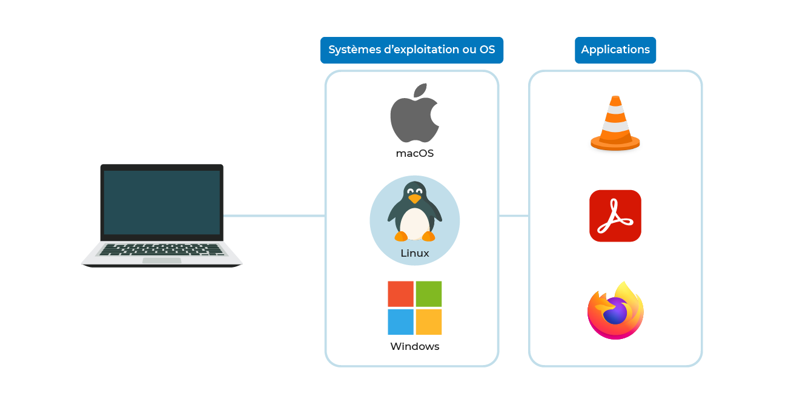
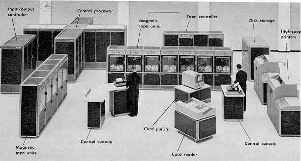
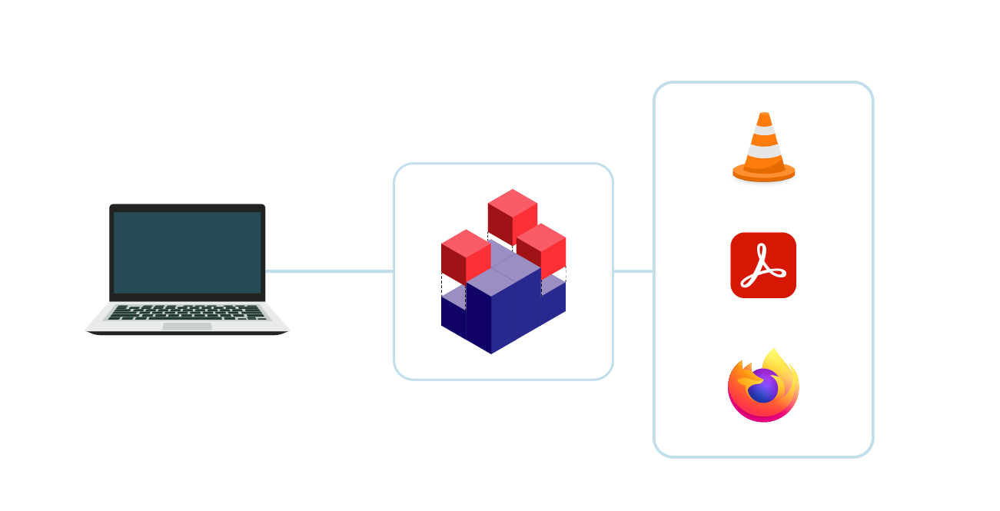
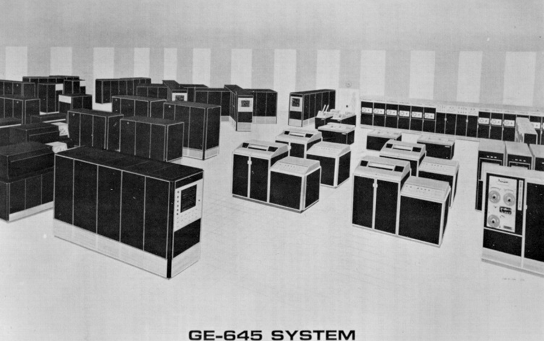
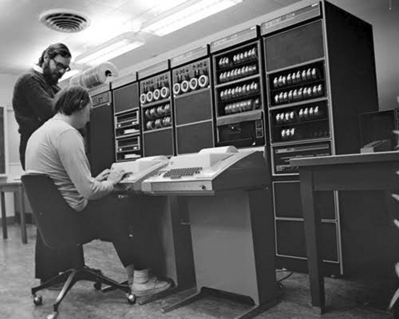
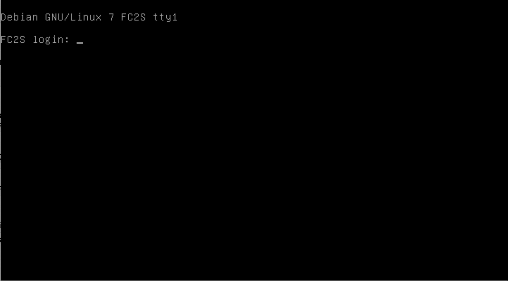
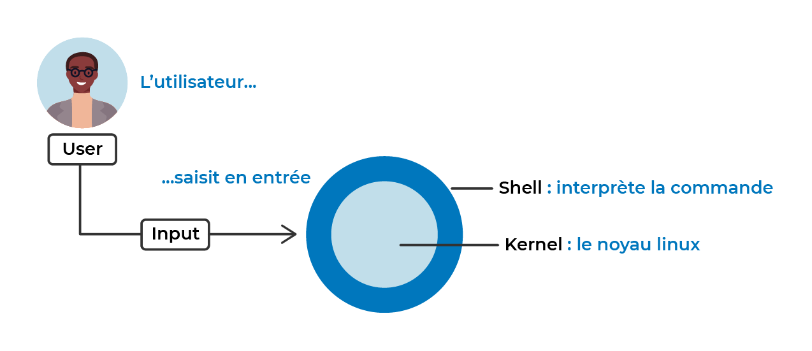

#BTS #1A #SISR

- [Introduction](#introduction)
  - [Un peu d'histoire](#un-peu-dhistoire)
    - [Unix, l'ancêtre de Linux](#unix-lancêtre-de-linux)
  - [La philosophie du libre](#la-philosophie-du-libre)
  - [Linux est partout, vraiment !](#linux-est-partout-vraiment-)
- [Terminaux](#terminaux)
  - [Histoire](#histoire)
  - [Virtualisation des terminaux de commande](#virtualisation-des-terminaux-de-commande)
  - [Le shell, l’interpréteur de commandes](#le-shell-linterpréteur-de-commandes)
    - [Origines et objectifs](#origines-et-objectifs)
    - [Les principaux shells sous Linux](#les-principaux-shells-sous-linux)
- [Bash](#bash)
  - [Les bases du shell](#les-bases-du-shell)
    - [Les commandes](#les-commandes)
      - [man || --help](#man----help)
        - [Définition](#définition)
        - [Utilisation](#utilisation)
      - [cd](#cd)
        - [Définition](#définition-1)
        - [Utilisation](#utilisation-1)
      - [pwd](#pwd)
        - [Définition](#définition-2)
        - [Utilisation](#utilisation-2)
      - [ls](#ls)
        - [Définition](#définition-3)
        - [Utilisation](#utilisation-3)
      - [echo](#echo)
        - [Description](#description)
        - [Utilisation](#utilisation-4)
      - [touch](#touch)
        - [Description](#description-1)
        - [Utilisation](#utilisation-5)
      - [cat](#cat)
        - [Description](#description-2)
        - [Utilisation](#utilisation-6)
      - [mkdir](#mkdir)
        - [Description](#description-3)
        - [Utilisation](#utilisation-7)
      - [rm](#rm)
        - [Description](#description-4)
        - [Utilisation](#utilisation-8)
        - [Avertissement](#avertissement)


*Ce cours grandement inspiré des excellentes ressources [Linux](https://openclassrooms.com/fr/courses/7170491-initiez-vous-a-linux) et [Système Linux](https://openclassrooms.com/fr/courses/7274161-administrez-un-systeme-linux) dispensées par OpenClassroom.*

# Introduction

## Un peu d'histoire

Vous connaissez probablement déjà quelques systèmes d'exploitation très répandus comme Windows, édité par Microsoft, ou macOS, édité par Apple. Mais connaissez-vous Linux ?

Linux est un système d'exploitation.

Un système d’exploitation, c’est un programme que l’on installe sur un ordinateur et qui va agir un peu comme un chef d’orchestre. Il lance la musique ! … Et fait en sorte que tout fonctionne.

Voyez-le comme un "super logiciel" qui fait l’interface entre vous et votre ordinateur, pour vous permettre de l’utiliser en gérant ses ressources : processeur, carte graphique, espace de stockage, mémoire vive, etc. On dit qu'il "exploite" les ressources physiques de l'ordinateur, d'où son nom : "système d'exploitation".

En fait, un système d’exploitation vous permet de faire tout ce que l’on peut faire aujourd’hui avec un ordinateur : installer des logiciels ou encore jouer à des jeux.

En bref :

- Vous démarrez votre ordinateur.

- Le système d’exploitation se charge, puis vous arrivez sur votre écran de bureau.

- Et vous pouvez utiliser vos programmes, jeux et applications en tout genre via votre souris, votre clavier, etc.

Et tout cela parce que Linux fait la liaison entre vos logiciels et le matériel de votre ordinateur.



### Unix, l'ancêtre de Linux

Nous sommes donc dans les années 70. Il y a des fleurs sur nos habits, et les ordinateurs sont d’énormes machines qui occupent l’espace d’une pièce entière, comme on en croise de temps en temps dans les films de science-fiction un peu kitsch.



Ces ordinateurs sont alors 100 000 fois moins puissants qu’un smartphone… Ils n’ont pas d’interfaces graphiques comme on en connaît aujourd’hui. Et pourtant, ils coûtent déjà très cher !

Les informaticiens de cette époque ont créé un "système" qui permet d’utiliser ces ordinateurs. Voyez ce système comme une sorte de langage qui permet à l’homme d’interagir avec la machine :

Grâce au système, l’homme rentre à la main une commande (une action ou un calcul que la machine doit réaliser).

Et l’ordinateur l’exécute.

La toute première version de ce système est née d’une alliance entre les gros laboratoires de recherche américains (AT&T), et des constructeurs comme General Electric. Et elle se nommait UNICS !

Les informaticiens aiment tout optimiser, alors UNICS est très rapidement devenu UNIX, simplement pour économiser une lettre !

La philosophie générale de ce système UNIX tient en une phrase : **chaque composant du système doit être développé pour faire une seule action et la faire parfaitement**.

Prenons un exemple.

Lorsque vous branchez un disque dur sur votre ordinateur, vous pouvez "lire" ce qu’il y a dessus (c’est-à-dire lancer les vidéos, regarder des images, ouvrir des documents), mais aussi ajouter de nouveaux éléments dessus. Eh bien, en fait, avec UNIX, il y a un morceau de code qui est spécifiquement fait pour gérer cela.

Autrement dit :

Ce morceau de code gère la lecture et l’écriture des données sur des périphériques de stockage. Il est le seul à effectuer cette opération. Et il le fait parfaitement bien.

Les autres parties du code qui ont besoin de lire ou d’écrire des données doivent obligatoirement faire appel à lui.

Hmm mais pourquoi le code est divisé en plusieurs parties ? Et qu’est-ce que ça veut dire, "faire appel à lui" ?

C’est la particularité du système !

UNIX est codé sous la forme de “modules”. Ce sont des morceaux de code qui communiquent entre eux pour bénéficier des actions qu’ils maîtrisent.



## La philosophie du libre

À la sortie du système UNIX, les industriels ne misaient pas beaucoup sur l’informatique pour faire de l’argent. Ils avaient bien tort, n’est-ce pas ? Mais très vite, l’intérêt financier s’est manifesté ! Alors, les industriels et les constructeurs sont passés sous un système de licences.

Voyez la licence comme la vente d’un droit d’utilisation. En achetant une licence, on paie l’autorisation à utiliser un logiciel ou un programme, mais dans un cadre précis et sous certaines conditions.

Des licences ont donc été créées à destination des entreprises qui voulaient utiliser ce système d’exploitation : il y a eu un UNIX pour HP, un UNIX pour IBM, un UNIX pour SUN, etc.

Il est difficile de normaliser un standard dans ces conditions, surtout si le code n’est pas librement accessible (à cause des licences).

Qu’est-ce que les licences ont à voir avec le cours ?

Eh bien, il faut comprendre que ce contexte d’essor informatique conjugué à l'appât du gain par les industriels, en a énervé plus d’un ! Richard Stallman est le premier à s’être vraiment révolté contre ce principe de licence UNIX. Une sombre histoire d’imprimante qui ne fonctionnait plus, ça l'a rendu furieux. 😄

Alors, il a lancé en 1983 la licence publique générale (de l’anglais GPL pour General Public Licence), ouvrant ainsi la voie au mouvement Open Source.

Cette licence vise à préserver la liberté d'utiliser, de modifier et de diffuser le système et ses versions dérivées. Elle garantit donc que les sources des programmes restent ouvertes et accessibles à… tout le monde !

Si vous vous demandez ce que ça veut dire et quelles autres implications cela a eu dans le monde de l’information et de l’informatique, on vous partage une “petite” anecdote :

En 1999, Richard Stallman a lancé les idées à l'origine de Wikipédia : une encyclopédie ouverte, gratuite et libre.

## Linux est partout, vraiment !

Au début des années 90 (20 ans après UNIX), un autre personnage important de notre histoire, Linus Torvalds, cherche à développer des outils de production sur une version d’UNIX qui fonctionne sur des PC domestiques ; à destination des particuliers, donc…

Vous l’aurez peut-être deviné, il appelle cette version Linux, en gardant le X en hommage à UNIX.

Linux est donc :

- Un descendant direct d’une longue lignée de systèmes d’exploitation qui remonte jusqu’à UNIX, leur ancêtre commun. 

- Il a gardé la même philosophie initiale : des programmes qui font une seule opération essentielle du système, mais qui la font parfaitement.

- Il est totalement intégré dans le mouvement du libre, ce qui en fait un système d’exploitation ouvert et gratuit !

Ce que les gens ne savent pas toujours, c’est que l’on retrouve Linux un peu partout aujourd’hui.

Par exemple, Android est un cousin proche de Linux, avec le même grand-père UNIX. Linux est également dans la box de votre fournisseur Internet, mais aussi dans les robots de la NASA et notamment "Ingenuity" qui s’est posé sur Mars en février 2021 !


# Terminaux

## Histoire

Dans la grande majorité des cas, les serveurs Linux que vous allez administrer sont dépourvus d'interfaces graphiques, car elles ne sont pas nécessaires pour exploiter les services hébergés sur ces machines. Pour interagir avec le système et le matériel, l'administrateur Linux utilise alors un terminal. 

Mais figurez-vous que, dans les années 60-70, un ordinateur occupait l'espace d'une pièce entière :



Ces ordinateurs étaient tellement volumineux que les opérateurs étaient souvent situés dans une autre salle ! Ils communiquaient avec les machines et les systèmes via des équipements dédiés à cet effet : les terminaux. 

Avec l'évolution des technologies, le terminal s'est rapproché de la machine, mais restait tout de même un équipement dissocié :



Le terminal informatique désignait alors un équipement périphérique entrée/sortie (au sens propre du terme, c'est-à-dire en périphérie du matériel principal) permettant d'opérer le système. Il pouvait posséder un clavier, un écran avec un pointer, une imprimante même…

Imaginez un gros minitel, et vous aurez une bonne image du matériel en question. Bien entendu, les choses ne sont pas restées en l'état : les terminaux physiques ont laissé la place aux terminaux virtuels, ou émulateurs de terminaux.

## Virtualisation des terminaux de commande

L'idée, c’est de passer par le logiciel pour émuler (ou simuler) l'équipement terminal physique et toutes ses fonctionnalités.

Ce logiciel est souvent un petit programme qui se lance sur un système d'exploitation et qui permet de se connecter localement ou à distance sur le serveur à administrer. Il devient donc possible de lancer plusieurs terminaux simultanément depuis le même environnement !

Le protocole VNC (Virtual Network Computing) permet notamment de prendre la main à distance sur un ordinateur. C’est un protocole de terminal virtuel graphique.

Le protocole RDP (Remote Desktop Protocol) qui permet de se connecter sur des serveurs Windows Terminal Serveur en est un également.

Et quid de l'écran noir après le démarrage du serveur ?

Oui, cet écran assez austère que vous obtenez après le démarrage du système est aussi un terminal. On l’a nommé historiquement une console :



La console sous Linux est un périphérique gérant le clavier et l'écran de l'ordinateur et propose d'interagir avec l'utilisateur via un terminal en mode texte. 

À vrai dire, la console de Linux propose 7 terminaux en mode texte, appelés aussi les terminaux physiques. Ils sont directement sur le clavier branché à l'ordinateur et disponibles à partir des combinaisons de touches : “CTRL+ALT+F1” ; “CTRL+ALT+F2” ; … jusqu’à “CTRL+ALT+F7”.

Chacune de ces combinaisons de touches propose l'émulation d'un terminal (en mode console) différent sur lequel il est possible de se connecter de manière indépendante avec un compte utilisateur différent.

Nous sommes en 2024, nous utiliserons des émulateurs de terminaux ;)

## Le shell, l’interpréteur de commandes

### Origines et objectifs

Le shell est un programme qui permet d'interpréter les commandes saisies par l'utilisateur et de les exécuter. Il est l'interface entre l'utilisateur et le noyau du système d'exploitation.

> Le libellé shell, signifiant “coquille”, désigne probablement la première couche logicielle entourant le noyau, comme une coquille de noix entoure sa noix.



Le shell étant un programme en soi, il dispose de son propre protocole de communication, ainsi l'administrateur sera obligé de saisir les commandes sur un format qui est adapté et compréhensible par cet interpréteur de commandes.

> Et à quoi ça sert, cet interpréteur de commandes ? 

Le rôle principal du shell est d'exécuter les commandes saisies par l'administrateur lui permettant d'effectuer des appels systèmes vers le noyau.

Mais l'interpréteur de commandes fournit également d'autres fonctionnalités essentielles permettant de faciliter la tâche de l'administrateur.

Par exemple, la possibilité de traiter de manière automatique les résultats des commandes saisies, ou encore de rediriger ces informations dans des fichiers ou vers d'autres commandes. Nous reviendrons un peu plus loin dans ce chapitre sur les principales fonctionnalités du shell.

### Les principaux shells sous Linux

Le premier shell apparaît dans les années 70, suivant rapidement la création des premiers systèmes Unix. Ken Thompson, l'un des créateurs de Unix, invente son propre shell en 1971 et le nomme Thompson shell.

En 1977, Stephen Bourne écrit le Bourne shell qui devient une référence en matière d'interpréteur de commandes, avec des fonctionnalités très intéressantes dont les plus notables sont :

- L'écriture de fichiers contenant des suites de commandes, les fameux scripts sh (l'extension sh est un préfixe pour shell) ;
- L'intégration d'un langage de programmation, avec des structures conditionnelles, itératives et la gestion des variables ;
- La gestion des canaux d'entrée/sortie et des redirections via des tubes ;
- La gestion de l'exécution de commandes en substitution avec les caractères back quotes : ``
- Etc.

D'autres shells sont venus ensuite compléter la petite famille des interpréteurs de commandes pour systèmes Unix/Linux, je peux notamment citer :

- le C Shell, qui dispose d'un langage très proche du langage C (le langage natif des systèmes Unix/Linux) et donc très populaire pour cette raison ;
- le KornShell, développé plus tard, début des années 80, apporte de son côté une amélioration du C Shell avec une intégration d'autres langages comme le Perl, le TCL par exemple, le support de tableaux associatifs, etc.

Sous Linux, le shell standard est le **Bash** (pour Bourne Again Shell). Développé plutôt fin des années 80, cet interpréteur de commandes est un peu un condensé du meilleur de tous ses ancêtres.

# Bash

Nous allons nous intéresser au shell Bash, qui est le shell par défaut sous Linux. Bash est un acronyme pour Bourne Again Shell, en référence à son prédécesseur, le Bourne Shell (sh). Bash est un shell très puissant et complet, qui offre de nombreuses fonctionnalités pour interagir avec le système d'exploitation.

## Les bases du shell

### Les commandes

Le shell Bash permet d'exécuter des commandes système en les saisissant dans un terminal. Voici quelques exemples de commandes courantes :

- `ls` : liste les fichiers et répertoires du répertoire courant.
- `cd` : change de répertoire.
- `pwd` : affiche le répertoire courant.
- `mkdir` : crée un répertoire.
- `rm` : supprime des fichiers ou des répertoires.
- `cp` : copie des fichiers ou des répertoires.
- `mv` : déplace des fichiers ou des répertoires.
- `cat` : affiche le contenu d'un fichier.
- `echo` : affiche du texte.
- `touch` : crée un fichier vide.
- etc.

Mais nous pouvons également scripter des commandes pour automatiser des tâches répétitives ou complexes. Nous verrons cela plus en détail dans la suite du cours.

Voyez plutôt :

```shell
> HISTTIMEFORMAT="" history | awk '{CMD[$2]++;count++;}END { for (a in CMD)print CMD[a] " " CMD[a]/count*100 "% " a;}' | grep -v "./" | column -c3 -s " " -t | sort -nr | nl | head -n10

     1  2732  11,7213%     cd
     2  1992  8,54642%     git
     3  1882  8,07448%     sudo
     4  1640  7,03621%     vim
     5  920   3,94714%     cat
     6  879   3,77124%     terraform
     7  648   2,78016%     python
     8  582   2,497%       curl
     9  572   2,45409%     ls
    10  556   2,38545%     rm
```

Voici un exemple, parmi beaucoup d'autres, que vous serez en mesure d'accomplir à la lecture de ce cours.

Avant de fuir devant ce *one-liner¹*, prenons le temps de revoir les bases des commandes ensemble.

Avant de se lancer, nous partirons du principe que vous disposez d'un environnement UNIX (Linux/Mac) ou de **WSL** (Windows Subsystem Linux) et que vous savez ouvrir un terminal (sur Windows vous pouvez installer Ubuntu depuis le Windows Store).

Voici sans plus attendre la liste des commandes que nous allons aborder dans cette partie :

- man || --help
- cd
- pwd
- ls
- echo
- touch
- cat
- mkdir
- rm
- |
- which
- grep
- column
- sort
- tail & head
- var
- while
- for
- if

Commençons !

#### man || --help

##### Définition
`man` ou *manual* est tout simplement la commande vous permettant d'ouvrir la documentation d'une autre commande. `man` est essentiel dans votre apprentissage et vous serez peut-être souvenant amené à lire `rtfm` *read the fucking manual* au travers de vos recherches sur le net.

On retrouve également des binaires qui embarquent leur propre documentation. Nul besoin d'utiliser le manuel pour savoir comment ils fonctionnent, on passe tout simplement le paramètre² `--help`.
```shell
> cd --help
cd: cd [-L|[-P [-e]] [-@]] [dir]
    Change the shell working directory.

    Change the current directory to DIR.  The default DIR is the value of the
    HOME shell variable.
```

Le choix d'utiliser `man` ou `--help` dépendra surtout de vos habitudes, sachez que l'un peut tantôt exister plutôt que l'autre. 

##### Utilisation
Son utilisation est simple, `man <command>`.

Regardons si le manuel contient sa propre documentation :
```shell
> man man

NAME
       man - an interface to the system reference manuals

SYNOPSIS
       man [man options] [[section] page ...] ...
       man -k [apropos options] regexp ...
       man -K [man options] [section] term ...
       man -f [whatis options] page ...
       man -l [man options] file ...
       man -w|-W [man options] page ...

DESCRIPTION
       man  is  the system's manual pager.  Each page argument given to man is normally the name of a program, utility or function.  The manual page associated with each of these arguments is then found and displayed.  A section, if provided, will direct man to look
       only in that section of the manual.  The default action is to search in all of the available sections following a pre-defined order (see DEFAULTS), and to show only the first page found, even if page exists in several sections.

```

Pour naviguer dans cette fenêtre, utilisez les flèches haut/bas/droite/gauche et appuyer sur la lettre `q` pour quitter. Nous verrons plus en détails dans ce livre ce type d'action dans le chapitre 6 sur Vim.

Nous avons donc ici un grand nombre d'information sur comment utiliser la commande `man` ainsi que ses options disponibles.

Retenez donc, en cas de doute sur l'utilisation d'une commande, `man ma_commande` et le tour est joué.

**Exercice** :
Trouver le manuel de la command `dmesg`.

#### cd

##### Définition
`cd` ou *change directory* est la commande que vous utiliserez (tout le temps) pour vous déplacer dans votre ordinateur.

##### Utilisation
Son usage est très simple, `cd` suivi du nom du dossier dans lequel vous souhaitez aller.
```shell
> cd mon_dossier/ 
```

Vous pouvez également vous déplacer directement dans une arborescence.
```shell
> cd mon_dossier/mon_sous_dossier/mon_sous_sous_dossier
```

Vous utiliserez également souvent la notion des chemins relatifs³ et absolus ⁴.

Pour vous rendre dans le dossier parent:
```shell
> cd ..    # remonter d'un cran
> cd ../.. # remonter de deux crans
> # etc
```

Pour vous rendre dans un dossier en chemin absolu (à partir de `/`):
```shell
> cd /var/log # depuis / puis le dossier var/ puis le dossier log
```

Lancer seulement la commande `cd` vous amènera automatiquement dans votre répertoire utilisateur.

**Exercice :**
Aller dans le répertoire nommé `tmp` situé à la racine de votre ordinateur. 


#### pwd

##### Définition
`pwd`, ou *print working directory*, vous aidera à retrouver votre chemin. Cette commande est très simple d'utilisation et vous sera d'une grande aide en cas de confusion.

##### Utilisation
Il suffit de lancer la commande seule :
```shell
> pwd
/tmp
```

En reprenant l'exemple de la commande cd lancée sans argument, on note que le dossier courant passe de `/tmp` au répertoire utilisateur `/home/lebaron`.
```shell
> cd
> pwd
/home/lebaron
```

#### ls 

##### Définition
`ls` ou tout simplement *list* permet d'afficher le contenu d'un dossier.

##### Utilisation
D'une simplicité première, la commande dispose néanmoins de nombreux paramètres qui viendront la rendre comme un atout redoutable lors de vos sessions d'administration ou de développement.
```shell
> ls
Desktop  Documents Downloads Pictures Work
```

Je ne vous présenterai ici que les arguments `alhtc` mais je vous encourage à regarder ce que `man` indique sur la commande `ls`.

1. -a
L'argument `-a` vous permettra d'afficher les fichiers et dossiers cachés, ce type de document commence toujours par un `.` (*exemple: `.mon_fichier_caché`*).
```shell
> ls -a
.  ..  .bash_history  .bash_logout  .bashrc
```

Nous retrouvons ci-haut trois fichiers cachés, `.bash_history`, `.bash_logout`, `.bashrc` et l'indication du chemin courant `.` ainsi qu'il existe un répertoire racine `..` (nous pourrions ainsi l'atteindre avec `cd ..`).

2. -l
Cet argument permet d'afficher la sortie de la commande sous un format de liste.

Si nous reprenons notre précédant exemple :
```shell
> ls -l
total 0
```

Pourquoi aucune réponse n'est visible ? Tout simplement parce que notre dossier ne comportait que des fichiers cachés. Il faut combiner les arguments `-a` et `-l` pour pouvoir avoir plus d'informations sur le contenu de notre dossier.
```shell
> ls -al # noter ici qu'il est possible d'écrire -a -l ou -al
total 8
drwxrwxr-x  2 lebaron lebaron 4096 juil. 21 08:23 .
drwxr-x--- 31 lebaron root 4096 juil. 21 08:25 ..
-rw-rw-r--  1 lebaron lebaron 1064142 juil. 21 08:23 .bash_history
-rw-rw-r--  1 lebaron lebaron 220 juil. 21 08:23 .bash_logout
-rw-rw-r--  1 lebaron lebaron 5982 juil. 21 08:23 .bashrc

```

Beaucoup d'informations additionnelles sont présentes, voyons rapidement ensemble de quoi il s'agit.

`drwxrwxr-x`, `drwxr-x---`, `-rw-rw-r--` correspondent aux droits du propriétaire, groupes ou autres utilisateurs sur vos documents et fichiers. À ceci près que ces droits sont préfixés par le type des éléments listés.

Par exemple :
- `drwxrwxr-x  2 void void 4096 juil. 21 08:23 .`, la première lettre `d` indique que le répertoire courant `.` est un **d**irectory (dossier).
- `drwxr-x--- 31 void void 4096 juil. 21 08:25 ..`, il en va de même pour le dossier parent `..` qui est en effet un autre répertoire **d**.
- le symbole `-` indique que le document est un fichier.

S'en suit alors trois lots de trois lettres, correspondant à trois propriétés de droits, ceux du propriétaire du fichier/dossier, ceux des groupes (que nous aborderons plus tard), et le reste du monde.

Ces trois lettres seront toujours :
- `r` pour indiquer le droit de lecture (*read*)
- `w` pour indiquer le droit d'écriture (*write*)
- `x` pour indiquer le droits d'execution (*execute*)

Vous commencez peut-être à mieux comprendre certaines de vos précédents messages d'erreurs, en particulier un certain `permission denied`.

À la suite de ces éléments, nous trouvons un chiffre ou nombre (2, 31, 1). Ceux-ci indiquent le nombre de sous-dossiers ou liens dans le dossier.

- `drwxrwxr-x  2 void void 4096 juil. 21 08:23 .` ne vous paraîtra peut-être peu logique aux premiers abords, mais le répertoire courant possède bel et bien deux sous dossiers que sont : `.` et `..`.
- `drwxr-x--- 31 void void 4096 juil. 21 08:25 ..` indique que le répertoire parent `..` dispose de 31 sous dossiers.

Arrive ensuite deux informations :
- le propriétaire utilisateur
- le groupe associé

Ici `lebaron` est l'utilisateur propriétaire et membre du groupe du même nom pour les trois fichiers cachés. Cependant le groupe `root` est associé au dossier parent. Repensez ici à ce que nous venons de voir au sujet des droits `rwx` !

S'en suit la taille de l'élément en octet⁵. Ici `4096`, `1064142`, `220`, `5982`. Nous verrons dans l'option suivante `-h` comment rendre lisible ces informations pour nous humain.

Enfin, nous retrouvons la date et l'heure de la dernière modification ainsi que le nom des éléments associés.

3. -h
Ici on transforme la sortie du poids des fichiers exprimé en octet en kilo-octet, mega-octet, giga-octet etc. `-h` est l'équivalant de `--human-readable`.

Comparez cette sortie avec celle du point 2. (`-l`).
```shell
> ls -alh
total 8,0K
drwxrwxr-x  2 void void 4,0K juil. 21 08:23 .
drwxr-x--- 39 void void 4,0K juil. 26 13:42 ..
-rw-rw-r--  1 void void 1,1M juil. 21 08:23 .bash_history
-rw-rw-r--  1 void void 2,0K juil. 21 08:23 .bash_logout
-rw-rw-r--  1 void void 5,9K juil. 21 08:23 .bashrc
```

4. -t
Cet argument nous permet de trier la sortie en affichant le contenu par date de modification. Très pratique pour retrouver les derniers documents édités/créés.

Prenons cet example :
```shell
> ls -at
total 8
total 8,0K
drwxrwxr-x  2 void void 4,0K juil. 21 08:23 .
drwxr-x--- 39 void void 4,0K juil. 26 13:42 ..
-rw-rw-r--  1 void void 1,1M juil. 21 08:23 .bash_history
-rw-rw-r--  1 void void 2,0K juil. 21 08:23 .bash_logout
-rw-rw-r--  1 void void 5,9K juil. 21 08:23 .bashrc
```

Je vais à présent modifier le fichier `.bashrc` *(nous verrons par la suite comment modifier un fichier)*.

Recommençons :
```shell
> ls -at
total 8
total 8,0K
-rw-rw-r--  1 void void 6,0K juil. 21 08:23 .bashrc
drwxrwxr-x  2 void void 4,0K juil. 21 08:23 .
drwxr-x--- 39 void void 4,0K juil. 26 13:42 ..
-rw-rw-r--  1 void void 1,1M juil. 21 08:23 .bash_history
-rw-rw-r--  1 void void 2,0K juil. 21 08:23 .bash_logout
```

Désormais c'est bel et bien le fichier `.bashrc` qui est affiché en première place.

5. -c
Enfin, cette option permet, en combinaison de `-lt`, trier par date de modification et non plus par ordre alphabetic.

```shell
> ls -altc
drwxr-x--- 39 void void 4,0K juil. 26 13:42 ..
-rw-rw-r--  1 void void 6,0K juil. 21 08:23 .bashrc
drwxrwxr-x  2 void void 4,0K juil. 21 08:23 .
-rw-rw-r--  > rm1 void void 1,1M juil. 21 08:23 .bash_history
-rw-rw-r--  1 void void 2,0K juil. 21 08:23 .bash_logout
```
Nous voyons ici que le dossier parent `..` a eu des modifications plus récentes que le fichier `.bashrc`.

#### echo

##### Description
La commande `echo` permet d'afficher du texte. C'est également une des commandes fondamentales et très utilisée.

##### Utilisation
Le principe est très simple, appeler cette commande et passer lui en paramètre votre texte.

```shell
> echo 'bonjour tout le monde'
bonjour tout le monde
```

Il est très largement recommandé de mettre votre texte entre quote simple ou double (nous verrons la différence plus loin dans ce chapitre).

Je vous invite à explorer le `man` de cette commande, vous pouvez par exemple, afficher du texte sur plusieurs lignes avec `-e` et `\n` (pour *new ligne*).
```shell
> echo -e 'bonjour\ntout le monde'
bonjour
tout le monde
```
#### touch

##### Description
La commande `touch` permet beaucoup de choses, mais nous allons essentiellement nous intéresser à sa capacité à créer des fichiers, vides certes mais qui peut s'avérer utile.

##### Utilisation
Pas de magie noire ici, la commande est d'une simplicité exemplaire :
```shell
> touch mon_fichier.txt
> ls
mon_fichier.txt
```

Vous pouvez également créer des fichiers cachés en préfixant le nom d'un point.
```shell
> touch .mon_fichier_secret
> ls -al
total 12
drwxrwxr-x  2 void void 4096 juil. 27 14:42 .
drwxr-x--- 40 void void 4096 juil. 27 14:41 ..
-rw-rw-r--  1 void void    0 juil. 21 08:23 .bash_history
-rw-rw-r--  1 void void    0 juil. 21 08:23 .bash_logout
-rw-rw-r--  1 void void   20 juil. 26 13:47 .bashrc
-rw-rw-r--  1 void void    0 juil. 27 14:42 .mon_fichier_secret
-rw-rw-r--  1 void void    0 juil. 27 14:41 mon_fichier.txt
```

Petit point d'attention ici :
- Les extensions sous linux ne sont pas obligatoires, sûrement dans le cadre de vos développements, mais il est tout à fait possible de créer un fichier `f` et de le manipuler : `touch f`.
- Évitez autant que faire se peut, voir tout le temps, de mettre des espaces/accents/caractères spéciaux dans le nom de vos fichiers et dossiers. Préférez utiliser `_` comme délimiteur de mots.

#### cat

##### Description

La commande `cat` (abréviation de concatenate) est utilisée pour lire le contenu d'un fichier, concaténer des fichiers et rediriger leur contenu dans le terminal ou dans d'autres fichiers.

##### Utilisation
Pour afficher le contenu d'un fichier sur l'écran, il suffit de passer le nom du fichier en argument à `cat`.

```shell
> cat mon_fichier.txt
Ceci est le contenu de mon fichier.
```

Si vous voulez concaténer deux fichiers et afficher leur contenu :

```shell
> cat fichier1.txt fichier2.txt
Contenu du premier fichier.
Contenu du second fichier.
```

Vous pouvez également utiliser `cat` pour créer un nouveau fichier en combinant plusieurs fichiers existants :

```shell
> cat fichier1.txt fichier2.txt > nouveau_fichier_concatene.txt
```

Dans cet exemple, les contenus de `fichier1.txt` et `fichier2.txt` sont fusionnés et enregistrés dans `nouveau_fichier_concatene.txt`.

#### mkdir

##### Description
La commande `mkdir`, qui signifie make directory, est utilisée pour créer des répertoires sur un système de fichiers.

##### Utilisation
Pour créer un nouveau dossier, utilisez la commande suivie du nom du dossier que vous souhaitez créer :

```shell
> mkdir nouveau_dossier
```

Vous pouvez aussi créer une structure de répertoires imbriqués avec l'option `-p` (parents) :

```shell
> mkdir -p dossier_parent/dossier_enfant/dossier_petit_enfant
```

Cette commande crée tous les dossiers nécessaires en une seule fois.

#### rm

##### Description
La commande `rm` (remove) est utilisée pour supprimer des fichiers ou des répertoires. Attention : son utilisation doit être faite avec précaution car la suppression est irréversible.

##### Utilisation
Pour supprimer un fichier :

```shell
> rm mon_fichier.txt
```

Pour supprimer un dossier et son contenu récursivement, utilisez l'option `-r` (récursive) :

```shell
> rm -r mon_dossier/
```

L'option `-f` (force) peut être ajoutée pour forcer la suppression sans demander de confirmation :

```shell
> rm -f mon_fichier.txt
```

Pour supprimer un dossier vide, vous pouvez également utiliser la commande `rmdir`.

```
> rmdir mon_dossier_vide/
```

Pour supprimer un dossier et son contenu récursivement, en forçant la suppression sans demander de confirmation, combinez les options `-r` et `-f` :

```shell
> rm -rf mon_dossier/
```

##### Avertissement
Comme vous l'avez mentionné, la commande `rm`, surtout avec les options `-r` et `-f`, doit être utilisée avec une grande prudence. Voici quelques conseils pour l'utiliser en toute sécurité :

- **Vérifiez toujours le répertoire de travail actuel** avant d'exécuter la commande `rm`. Utilisez `pwd` pour confirmer votre emplacement dans le système de fichiers.

- **Revoyez la commande avant de l'exécuter.** Prenez un moment pour vous assurer que vous supprimez ce que vous avez l'intention de supprimer.

- **Utilisez des chemins absolus** lorsque cela est possible pour éviter de supprimer accidentellement des fichiers ou des dossiers dans le mauvais répertoire.

- **Faites attention à l'utilisation des caractères génériques (`*`, `?`, etc.).** Ils peuvent correspondre à plus de fichiers que prévu. Par exemple, `rm -rf *` supprimera tout dans le répertoire courant sans confirmation.

- **Vérifiez avec les options `-i` ou `--interactive`** pour demander une confirmation avant chaque suppression. Cela peut aider à prévenir la suppression accidentelle.

  ```shell
  > rm -i mon_fichier.txt
  ```

- **Considérez l'utilisation d'aliases ou de fonctions shell** qui ajoutent des protections supplémentaires, comme déplacer les fichiers vers une corbeille au lieu de les supprimer définitivement.

- **Faites des sauvegardes régulières** afin que vous puissiez récupérer vos données si quelque chose est supprimé par erreur.

- **Utilisez la commande `ls` ou `tree` (si disponible)** pour lister le contenu avant de supprimer afin d'avoir une meilleure vue d'ensemble du dossier cible et son contenu.

  ```shell
  > ls mon_dossier/
  > tree mon_dossier/
  ```

- Évitez d'exécuter la commande `rm` en tant qu'utilisateur root à moins que cela ne soit absolument nécessaire, car cela augmente les risques de dommages au système en cas d'erreur.

En suivant ces conseils, vous pouvez minimiser les risques liés à l'utilisation de la commande `rm`. Gardez toujours à l'esprit qu'une fois qu'un fichier est supprimé avec cette commande, il est généralement impossible de le récupérer sans recourir à des outils spécialisés et même ainsi, il n'y a aucune garantie.
_______
¹ oneliner : *plusieurs actions/commandes en une seule ligne de code.*