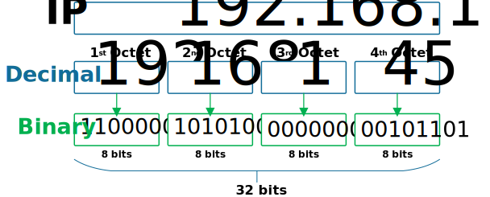
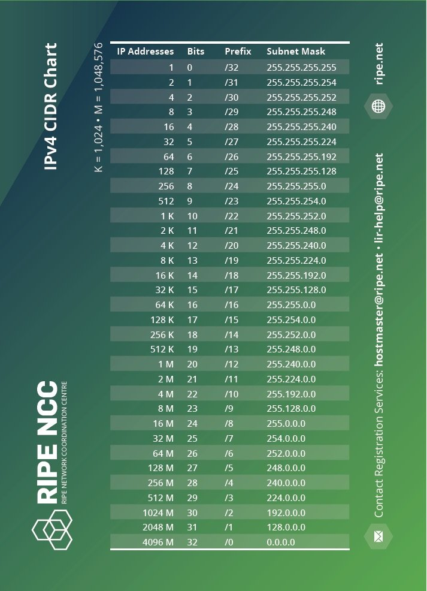

#BTS #1A 

- [Qu'est-ce que c'est ?](#quest-ce-que-cest-)
- [Adresse d’hôte et adresse de réseau](#adresse-dhôte-et-adresse-de-réseau)
  - [Masque de sous-réseau](#masque-de-sous-réseau)
  - [CIDR](#cidr)
  - [Importance des adresses d'hôte et de réseau](#importance-des-adresses-dhôte-et-de-réseau)
- [Définitions et rappels](#définitions-et-rappels)
  - [IP](#ip)
  - [Les classes d’adresse IP](#les-classes-dadresse-ip)
  - [Les adresses IP publiques](#les-adresses-ip-publiques)
  - [Les classes d’adresses IP privées, pour le réseau locale et entreprise](#les-classes-dadresses-ip-privées-pour-le-réseau-locale-et-entreprise)
  - [Le masque de Sous-Réseau](#le-masque-de-sous-réseau)
  - [La passerelle par défaut](#la-passerelle-par-défaut)
  - [Le serveur DNS](#le-serveur-dns)
  - [Adresse DHCP ou statique](#adresse-dhcp-ou-statique)
  - [A quoi ressemble une adresse aujourd’hui sur un PC](#a-quoi-ressemble-une-adresse-aujourdhui-sur-un-pc)

## Qu'est-ce que c'est ?

IP est le protocole utilisé sur INTERNET (qui est une interconnexion de réseaux au niveau mondial) mais
aussi pour la communication dans un réseau local.
Par rapport au système d’adressage physique basé sur les adresses MAC, le système d’adressage IP
introduit la notion de réseau et d’appartenance d’un poste à un réseau, grâce à l’adresse IP.

L'IP, ou Internet Protocol, est un protocole de communication qui définit les règles de formatage et de transmission des données sur le réseau Internet ainsi que sur les réseaux locaux (LAN). Ce protocole est essentiel pour la communication entre différents appareils connectés au réseau, permettant ainsi l'échange d'informations entre eux.

L'adresse IP est un identifiant unique attribué à chaque appareil connecté à un réseau qui utilise le protocole IP. Elle se compose d'une série de nombres divisés en quatre blocs (dans le cas d'IPv4) ou huit blocs (pour IPv6), qui sont séparés par des points (pour IPv4) ou des deux-points (pour IPv6). Cette adresse permet d'identifier de manière unique chaque appareil et de déterminer son emplacement sur le réseau.

Contrairement aux adresses MAC, qui sont attribuées par le fabricant à la carte réseau de l'appareil et qui servent à identifier physiquement l'appareil sur le LAN, les adresses IP sont attribuées logiquement et peuvent changer selon l'emplacement du dispositif dans le réseau. Les adresses IP peuvent être attribuées manuellement par un administrateur réseau ou automatiquement par un serveur DHCP (Dynamic Host Configuration Protocol).

L'introduction du système d’adressage IP a permis une organisation plus flexible et plus hiérarchique des réseaux informatiques. En effet, grâce à l'adresse IP, il est possible de déterminer non seulement l'identité unique d'un appareil mais aussi son appartenance à un sous-réseau spécifique. Cette organisation facilite la gestion du trafic sur les réseaux vastes et complexes comme Internet.

## Adresse d’hôte et adresse de réseau

Dans une adresse IP, les premiers bits correspondent à l'adresse du réseau, tandis que les derniers bits correspondent à l'adresse de l'hôte. L'adresse du réseau identifie le réseau auquel l'appareil est connecté, tandis que l'adresse de l'hôte identifie l'appareil spécifique sur ce réseau.

La séparation entre l'adresse de réseau et l'adresse d'hôte dans une adresse IP est cruciale pour le fonctionnement des réseaux IP. Elle est déterminée par un masque de sous-réseau, qui indique quelle partie de l'adresse IP correspond au réseau et quelle partie correspond à l'hôte.

### Masque de sous-réseau

Le masque de sous-réseau est une série de bits qui sert à identifier la portion de l'adresse IP qui représente le réseau et celle qui représente les hôtes sur ce réseau. Dans une adresse IPv4, le masque est souvent représenté sous la même forme que l'adresse IP elle-même, c'est-à-dire quatre nombres (de 0 à 255) séparés par des points. Par exemple, un masque de sous-réseau courant pour une adresse IPv4 pourrait être 255.255.255.0. Ceci signifie que les trois premiers blocs (ou octets) de l'adresse IP représentent l'adresse du réseau, tandis que le dernier bloc représente les hôtes sur ce réseau.

### CIDR

Avec l'introduction du Classless Inter-Domain Routing (CIDR) dans les années 1990, il a été possible d'allouer des adresses IP d'une manière plus flexible qu'auparavant. Avec CIDR, un suffixe (comme /24) est ajouté à la fin des adresses IP pour indiquer la taille du préfixe du réseau (le nombre de bits réservés pour l'adresse du réseau). Par exemple, dans 192.168.1.0/24, le "/24" indique que les 24 premiers bits sont utilisés pour identifier le réseau, laissant les 8 bits restants pour identifier les hôtes spécifiques.

### Importance des adresses d'hôte et de réseau

La distinction entre adresse d'hôte et adresse de réseau permet aux routeurs et autres équipements réseaux d'acheminer efficacement les paquets de données vers leur destination finale. Lorsqu'un paquet arrive sur un routeur, celui-ci utilise l'adresse du réseau pour déterminer vers quel autre segment du réseau ou vers quel autre routeur diriger le paquet. Une fois que le paquet atteint le segment du réseau où se trouve son destinataire final, il peut alors utiliser l'adresse d'hôte pour remettre le paquet au dispositif spécifique concerné.

En somme, cette organisation hiérarchique et cette distinction entre adresse d'hôte et adresse de réseau sont fondamentales pour la communication efficace sur Internet ainsi que sur les réseaux locaux plus restreints, permettant aux données d'être routées avec précision vers leurs destinations exactes dans un monde numérique vaste et complexe.

## Définitions et rappels

### IP

C’est un numéro d’identification qui est attribué à un périphérique connecté à un réseau informatique, de façon permanente ou provisoire, basé sur l’acheminement de données.

Il existe de nos jours de norme, l’IPV4 la plus utilisé qui est en 32bits, et depuis quelques années il y a la version en 128bits qui est l’IPV6.

L’IPV6 fut créée dans le cadre de la pénurie d’adresse IPV4.

L’IPV4 est une adresse avec quatre groupes de nombres compris entre 0 et 255, séparés par des points, exemple : 172.58.10.55

Chaque donnée transmise contient les adresses IP de l’émetteur et du destinataire (c’est un comme une lettre que vous recevez par la poste, il y a votre adresse et celle de l’envoyeur, ce qui permet un bon acheminent dans le cas contraire le retour à l’envoyeur), ce qui permet la base, TCP/IP : TCP (Transmission Control Protocol) et IP (Internet Protocol).

### Les classes d’adresse IP

Classe A :
Début d’adresse : 0.0.0.0 et fin : 127.255.255.255  
Masque de sous réseau par défaut : 255.0.0.0

**Classe B :**  
Début d’adresse : 128.0.0.0 et fin : 191.255.255.255  
Masque de sous réseau par défaut : 255.255.0.0

**Classe C :**  
Début d’adresse : 192.0.0.0 et fin : 223.255.255.255  
Masque de sous réseau par défaut : 255.255.255.0

**Classe D multicast :**  
Début d’adresse : 224.0.0.0 et fin : 239.255.255.255  
Masque de sous réseau par défaut : non défini

**Classe E réservée :**  
Début d’adresse : 240.0.0.0 et fin : 255.255.255.255  
Masque de sous réseau par défaut : non défini

### Les adresses IP publiques

Ces adresses IP publiques sont attribuées à des ordinateurs afin de se connecter à un autre sur internet. Ceci permet une communication entre deux ordinateurs via internet.

Cette adresse est unique au niveau mondial et non comprise dans les adresses privées.

Il y a des exceptions comme :

L’adresse 127.0.0.0 est dédiée au test de boucle locale dont notamment l’adresse 127.0.0.1 le localhost qui fait une boucle sur le PC.

L’adresse 0.0.0.0 est réservée normalement pour désigner un destination invalide, sur un serveur cela signifie une écoute de plusieurs adresses et dans le routage cela mène au reste d’internet plutôt que sur un réseau locale.

### Les classes d’adresses IP privées, pour le réseau locale et entreprise

Les adresses privées sont utilisées dans les réseaux locaux et des entreprises, qui n’ont pas besoin d’une adresse IP mondiale pour chaque hôte, imprimante, etc…

Un réseau privé utilise des adresses IP qui sont non accessible par internet.

La classe A : comprend 16 777 216 d’adresses, comprises entre 10.0.0.0 et 10.255.255.255

La classe B : comprend 1 048 576 adresses, comprises entre 172.16.0.0 et 172.31.255.255

La classe C : comprend 65 536 adresses, comprises entre 192.168.0.0 et 192.168.255.255

### Le masque de Sous-Réseau

Les adresses IPv4 sont composées de deux parties : le sous-réseau et l’hôte.  
Le masque de sous-réseau permet d’adressé une adresse IP en rapport d’un classe, par exemple un sous-réseau en 255.255.0.0, cela donne à l’hôte une IP entre 128.0.0.0 et 191.255.255.255 de la classe B. (Attention ceci est un exemple, rester dans les adresses IP privées voir plus haut)

Les octets des masques de sous-réseau doivent systématiquement être de valeur: 0, 128, 192, 224, 240, 248, 252, 254 et 255.

### La passerelle par défaut

La passerelle par défaut, c’est l’adresse de l’élément qui va permettre la discussion entre deux hôtes, par exemple un routeur, serveur ou une boxe internet.  
Dans certains cas, la passerelle par défaut en configuration DHCP entre deux hôtes direct sera données par l’une machine, rendant le dialogue et le transfert de donnée possible.

### Le serveur DNS

L’adresse IP du serveur DNS est important dans le cas où l’on veut allez sur internet, généralement on prend celle données par sa box (SFR, Orange, Free, etc…) personnellement je suis sauvent sur celle de Google (8.8.8.8).

### Adresse DHCP ou statique

Dans votre système d’exploitation vous avez la possibilité de configurer le réseau de deux façons :

Adresse IP statique : vous devez choisir une dresse pour votre machine et celle-ci ne changera pas à chaque démarrage, car fixé par vous.

Adresse IP DHCP : C’est une adresse donnée par un serveur, box , routeur, etc… qui est automatique et qui peut changer à chaque démarrage.

### A quoi ressemble une adresse aujourd’hui sur un PC

IP Machine : 192.168.10.128  
Masque de sous-réseau : 255.255.255.0  
Passerelle par défaut : 192.168.10.1 (La box généralement)  
Serveur DNS : 192.168.1.1  
On peut voir aussi Serveur DHCP IPV4 : 192.168.10.1 (Généralement c’est la box qui donne les adresses)