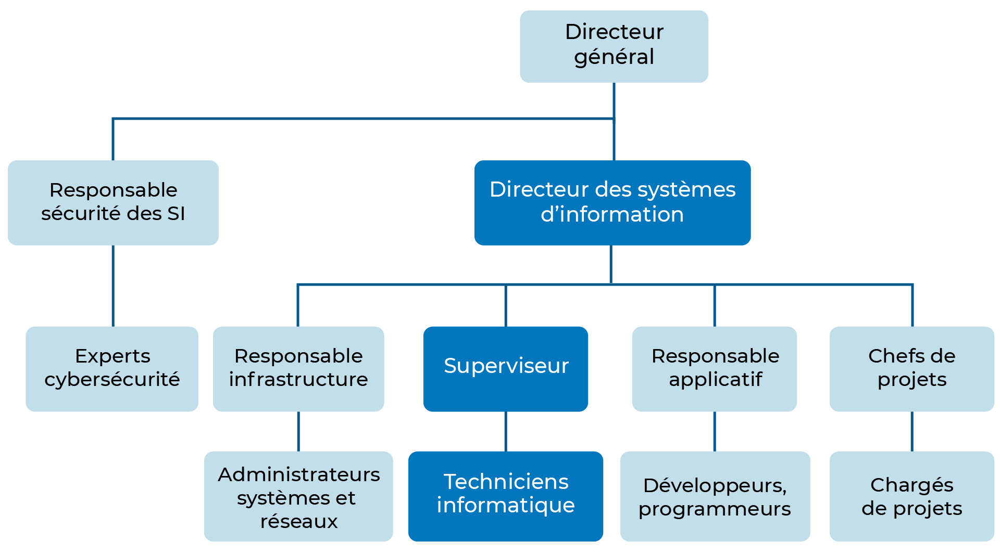

#BTS #1A #SISR

- [Pourquoi devenir technicien informatique ?](#pourquoi-devenir-technicien-informatique-)
  - [Pourquoi faire ce métier ?](#pourquoi-faire-ce-métier-)
  - [Est-ce un métier qui recrute ?](#est-ce-un-métier-qui-recrute-)
  - [Salaire ?](#salaire-)
- [Travaillez au sein d’une Direction des Systèmes d’Information (DSI)](#travaillez-au-sein-dune-direction-des-systèmes-dinformation-dsi)
  - [Organigramme de la DSI](#organigramme-de-la-dsi)
  - [Les prestataires externes au Système d’Information (SI)](#les-prestataires-externes-au-système-dinformation-si)
- [Travaillez au sein d’une Entreprise de Services du Numérique (ESN)](#travaillez-au-sein-dune-entreprise-de-services-du-numérique-esn)
- [Pratiquez en tant que travailleur indépendant](#pratiquez-en-tant-que-travailleur-indépendant)
- [Découvrez les grandes activités du technicien informatique](#découvrez-les-grandes-activités-du-technicien-informatique)
  - [Alimentez le parc informatique](#alimentez-le-parc-informatique)
  - [Permettez l’accès aux services réseaux de l’entreprise](#permettez-laccès-aux-services-réseaux-de-lentreprise)
  - [Assurez le support technique](#assurez-le-support-technique)
  - [Conseillez et impliquez les utilisateurs](#conseillez-et-impliquez-les-utilisateurs)
  - [Maintenez le parc informatique opérationnel](#maintenez-le-parc-informatique-opérationnel)

*Ce cours grandement inspiré de l'[excellent](https://openclassrooms.com/fr/courses/6825041-decouvrez-le-metier-de-technicien-informatique) dispensé par OpenClassroom.*

## Pourquoi devenir technicien informatique ?

Le technicien informatique est un professionnel qui intervient dans la gestion et la maintenance des systèmes informatiques d'une entreprise ou d'une organisation. Il est chargé de veiller au bon fonctionnement des équipements informatiques, de résoudre les problèmes techniques et de garantir la sécurité des données et des réseaux.

Il assure également le bon fonctionnement du matériel informatique et fournit aux utilisateurs des solutions pour pallier aux éventuelles pannes ou difficultés qu’ils peuvent rencontrer.

Vous pouvez trouver différents intitulés pour désigner ce métier :

- technicien systèmes et réseaux
- technicien support
- hotliner
- technicien helpdesk
- technicien réseaux et télécommunications
- technicien de maintenance informatique
- technicien d’assistance informatique
- technicien d’exploitation
- gestionnaire en maintenance et support en informatique

### Pourquoi faire ce métier ?

Vous êtes très intéressé par le domaine de l’informatique ?

Vous cherchez un poste qui vous permettra de combiner plusieurs compétences ?  

Vous adorez aider les gens ?

Vous êtes empatique ? 

Vous savez rester calme face à une crise et rassurer les gens lors de situations délicates ?

Vous êtes curieux et toujours motivé lorsqu’il s’agit d’apprendre de nouvelles technologies informatiques ? 

### Est-ce un métier qui recrute ?

Le métier de technicien informatique se positionne dans le top 3 des métiers de l’informatique les plus recherchés par les recruteurs (source : article de [RégionsJob](https://www.hellowork.com/fr-fr/medias/informatique-tendances-recrutement.html) datant de 2019).

Les entreprises sont nombreuses à amorcer une transformation numérique : elles digitalisent de plus en plus leurs services : formations à distance, gestion de plannings, visioconférences, messagerie instantanée, espaces de travail collaboratifs ou encore facturation. Elles ont donc besoin de profils techniques pour les aider !

### Salaire ?

C'est une question qui revient souvent. Le salaire d’un technicien informatique varie en fonction de plusieurs critères : l’expérience, la région, la taille de l’entreprise, le secteur d’activité, les compétences techniques, etc.

Un technicien informatique peut prétendre à une rémunération mensuelle brute de 1 700 € (pour un débutant) à 2 300 € (pour un profil confirmé). Cette rémunération peut également varier selon la taille de la structure qui vous emploie et la région. Ne prenez pour autant pas ces chiffres pour argent comptant, ils sont donnés à titre indicatif.

## Travaillez au sein d’une Direction des Systèmes d’Information (DSI)

Aujourd’hui, il est presque impossible pour une entreprise, peu importe sa taille ou son secteur d’activité, de se passer d’outils numériques et d’un système d’information.

Le technicien informatique peut ainsi être amené à exercer sa fonction un peu partout : grandes ou petites entreprises, dans le privé comme dans le public, ou encore chez les particuliers.

Son environnement de travail pourra en revanche varier selon la structure dans laquelle il choisit d’évoluer.

Au sein d’une entreprise, tout le matériel informatique et les services numériques constituent ce qu’on appelle le Système d’Information ou SI. Ce SI est géré au sein d’un département dédié dans l’entreprise qui s'appelle la Direction des Systèmes d'Information ou plus communément la DSI.

La DSI d'une entreprise est en charge de :

- l’activité de l’infrastructure informatique ;
- du traitement des données ; 
- du support technique ;
- de l'évolution du parc informatique ;
- et de l'amélioration de ses performances. 

Et elle fait tout cela en prenant compte des besoins et des priorités, mais aussi des coûts de maintenance et de production.

### Organigramme de la DSI

La DSI est composée de plusieurs services, chacun ayant des missions spécifiques. Voici les principaux services que l’on retrouve au sein d’une DSI.

À travers vos fonctions de technicien informatique, vous serez amené à collaborer avec l’ensemble des équipes sous la direction du Système d’Information.

Vous serez en première ligne : c’est vous qui recevrez les demandes des utilisateurs et ferez le premier diagnostic du problème rencontré par l’utilisateur dans l’entreprise. Vous serez alors le lien privilégié entre les employés qui utilisent directement le matériel et les services numériques et le reste de la DSI.

Vous serez donc amené à travailler avec vos collègues du service Support, les administrateurs en charge des serveurs, du réseau, de la sécurité et de la maintenance, ou encore les développeurs si l’entreprise produit elle-même certaines applications.

### Les prestataires externes au Système d’Information (SI)

Autres acteurs du SI que vous pourrez rencontrer dans votre quotidien de technicien informatique : les prestataires externes.

Ce terme assez générique englobe en réalité un grand nombre de personnes qui sont amenées, de près ou de loin, à apporter un service à la Direction du Système d’Information.

De nombreux intervenants externes à la DSI existent pour une entreprise. Voici une liste des plus courants :

- fournisseurs de matériels et/ou consommables ;
- constructeurs et/ou éditeurs de logiciels ;
- prestataires assurant la maintenance d'équipements ;
- consultants et/ou technico-commerciaux ;
- hébergeurs ;
- Fournisseurs d’Accès à Internet.

Il est par exemple très courant que les entreprises fassent appel à un prestataire externe pour gérer leurs imprimantes. Il faut donc être en lien avec le technicien en charge de la maintenance de celles-ci.

## Travaillez au sein d’une Entreprise de Services du Numérique (ESN)

Un autre type de structure dans laquelle peut évoluer le technicien informatique est l’Entreprise de Services du Numérique ou ESN.

Une ESN est une société de services spécialisée dans les technologies du numérique et le domaine de l'informatique. Son rôle est de fournir des services externalisés aux entreprises (privées et publiques) qui en ont besoin ou en font la demande :

- conseil ;
- formation ;
- maintenance ;
- assistance ;
- exploitation
- ou encore conception.

Parmi les Entreprises de Services du Numérique les plus célèbres, on peut citer Capgemini, Orange Business Services ou encore IBM. Elles regroupent plusieurs experts métiers appelés consultants et sous-traitent leurs services directement à leurs clients sous forme de missions facturées à la journée.

## Pratiquez en tant que travailleur indépendant

Autre possibilité pour le technicien informatique : devenir travailleur indépendant, aussi nommé auto-entrepreneur ou freelance.

Dans ce cas, le technicien informatique sera à la fois son propre patron et son propre employé. Cela implique qu’il devra lui-même chercher et fidéliser sa clientèle, mais également gérer la partie administrative et financière de son entreprise : suivi clientèle, chiffre d’affaires, cotisations sociales, charges fiscales...

Le technicien informatique deviendra alors prestataire de ses clients. À ce titre, il sera amené à :

- assurer des missions auprès de ceux-ci ; 
- établir des devis et des contrats de prestations pour chacune d’elles ;
- et les facturer.

Le freelance peut établir des contrats pour des missions de longue durée avec ses clients comme, par exemple, un contrat annuel de maintenance du parc informatique. Ou bien il peut établir une facture pour chaque intervention en se basant sur des forfaits selon la nature ou la durée de celle-ci.

Sachez que, peu importe le type de structure dans laquelle le technicien informatique va évoluer, il peut être soumis aux astreintes techniques afin d’assurer une certaine continuité de service. Par exemple, un technicien informatique, selon son poste, peut être amené à effectuer des actions de dépannage un jour férié. Cela demande donc mobilité et disponibilité !

## Découvrez les grandes activités du technicien informatique

En tant que technicien informatique au sein d'une entreprise, votre rôle est d'assurer le bon fonctionnement du parc informatique et de fournir aux utilisateurs des solutions pour pallier aux éventuelles pannes ou difficultés qu’ils peuvent rencontrer. Ce rôle englobe un certain nombre de tâches et de responsabilités que nous allons maintenant découvrir.

### Alimentez le parc informatique

L’une des missions principales du technicien informatique est d'installer et de configurer des machines clientes pour les utilisateurs.

Ce qu'on appelle une machine cliente est en réalité l’ordinateur que l'utilisateur final utilise pour effectuer son travail quotidien. On parle aussi de poste de travail, c’est-à-dire l'ordinateur que l'utilisateur final utilise pour effectuer son travail quotidien. 

Vous allez également installer sur ces postes de travail des systèmes d’exploitation. Ils sont là pour faire le lien entre l’électronique de la machine et l’interface de l’utilisateur, c’est-à-dire ce qu’il voit et ce qu’il fait sur la machine. Vous en connaissez certainement : Windows, OS X et Linux sont des systèmes d’exploitation.

Une fois le matériel prêt physiquement, vous pourrez installer et paramétrer les logiciels métiers : une application métier, un logiciel de messagerie, un accès à des dossiers spécifiques selon son service, un navigateur Internet...

Vous aurez également à mettre en service des périphériques divers comme les claviers, les souris, les écrans, les webcams, ou encore les vidéoprojecteurs et les imprimantes. 

### Permettez l’accès aux services réseaux de l’entreprise

Nous venons de voir que vous aurez pour mission d’installer des machines clientes (ou poste de travail) pour les utilisateurs.

Et bien vous devrez également intervenir sur des machines… serveurs !
Dans un Système d’Information, l’ensemble des équipements reliés entre eux constitue ce qu’on appelle le réseau informatique.

Au sein de ce réseau, le rôle du serveur est de fournir des informations, stocker des données ou encore héberger des applications qui seront accessibles par tous les équipements qui en auront besoin. C’est ce qu’on appelle des services réseaux.

Votre mission en tant que technicien informatique est de préparer ces machines serveurs et de les intégrer au réseau de l’entreprise de façon à ce qu’elles soient accessibles depuis les postes de travail des utilisateurs.

### Assurez le support technique

La plus grande activité du technicien informatique est de recueillir les demandes des utilisateurs, de les orienter et d’intervenir en cas de panne en proposant les solutions les plus adaptées.

Vous serez amené à intervenir physiquement sur un équipement ou à porter assistance aux utilisateurs à distance, soit par visioconférence, soit par téléphone.

### Conseillez et impliquez les utilisateurs

Au-delà de l’aspect dépannage, le technicien informatique a aussi un rôle de conseiller.

Vous avez la responsabilité de former et de guider les employés dans leur utilisation quotidienne de leur poste de travail, des périphériques ou encore des logiciels mis à leur disposition.

Vous participez également à la sécurisation des données de l’entreprise en vous assurant que les utilisateurs respectent bien les règles de l’organisme sur l’utilisation des ressources informatiques.

Il faut responsabiliser les utilisateurs en leur rappelant qu’en informatique aussi il y a des règles à respecter. Vous en trouverez certaines dans le guide des bonnes pratiques de l’ANSSI (Agence nationale de la sécurité des systèmes d'information). C'est [ici](https://cyber.gouv.fr/sites/default/files/2017/01/guide_cpme_bonnes_pratiques.pdf) !

### Maintenez le parc informatique opérationnel 

En plus de gérer les opérations de dépannage pour les utilisateurs, vous devez aussi gérer votre parc informatique.

Cela débute par un référencement de l’ensemble des équipements (postes de travail, serveurs, équipements réseaux, imprimantes, téléphones/smartphones, clavier, écran, souris…) dans un outil d’inventaire dédié à la gestion de parc.

Dans votre quotidien de TI, vous devez remplacer mais aussi anticiper le matériel défectueux et les consommables, comme les disques durs, les claviers, les toners d’imprimantes, etc.

Lorsque que l’on parle de matériel en stock destiné au remplacement, on évoque souvent le terme de spare : ce terme anglais signifie de rechange.

Vous êtes également en charge de la maintenance préventive du parc, c’est-à-dire que vous devez mettre à jour les applications et les différents systèmes, ainsi que veiller au bon déroulement des sauvegardes.

Vous devez avoir une bonne vue d’ensemble de votre parc informatique afin de le garder opérationnel.