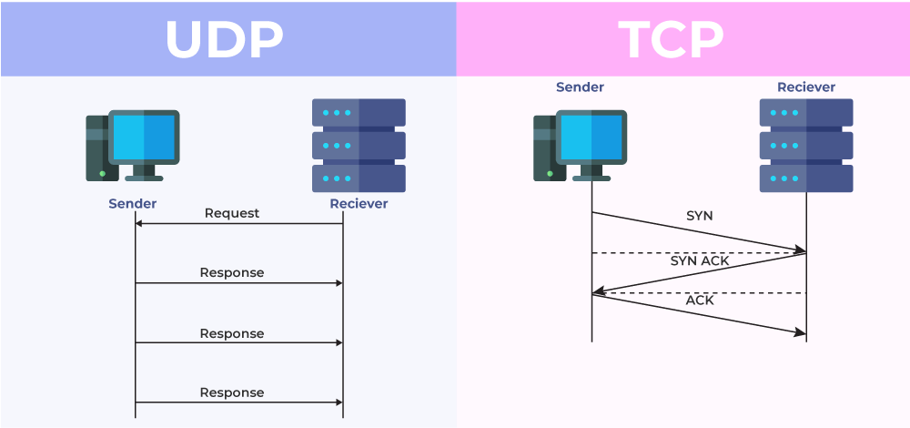
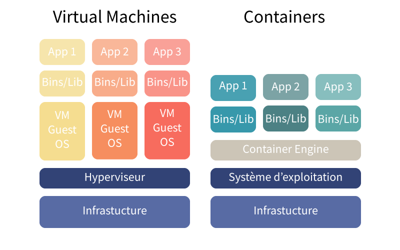

#BTS #SIO #2A

Bienvenue, vous êtes maintenant dans votre deuxième année de BTS SIO et nous allons ensemble entamer la continuité de l'option SISR (Système & Réseaux).

Nous allons ici établir quelques rappels des bases d'internet.

Je vous invite également à lire attentivement [ce cours](https://github.com/LeBaronDeCharlus/BTS_SIO_SISR/blob/main/1A/01_%20Concepts%20Fondamentaux.md)et être sûr d'avoir bien assimilé son contenu.

Dans un premier temps, nous allons revoir les notions générales qui vous permettront d'aller plus loin dans votre apprentissage.

Attention, veuillez à bien prendre vos notes durant nos échanges, tout n'est pas forcément écrit ici.

C'est parti ? 🚀

# Internet 🕸

Qu'est-ce qu'internet ? C'est un réseau mondial d'ordinateurs interconnectés. Il permet de communiquer, de partager des informations et d'accéder à des services en ligne. Il repose sur un protocole de communication appelé **TCP/IP**.

Internet a été créé en 1969 par l'armée américaine, il s'appelait alors ARPANET. Il a été ouvert au public en 1991. Il a été inventé pour permettre aux militaires de communiquer entre eux en cas de guerre nucléaire, par Tim Berners-Lee.

Internet fonctionne grâce à un protocole de communication appelé TCP/IP. Ce protocole permet de découper les données en paquets, de les envoyer sur le réseau et de les réassembler à l'arrivée.

## Les services

Internet propose de nombreux services, dont les plus connus sont :

- le web, qui permet de consulter des pages web à l'aide d'un navigateur web.
- le mail, qui permet d'envoyer et de recevoir des messages électroniques.
- le chat, qui permet de discuter en temps réel avec d'autres personnes.
- le streaming, qui permet de regarder des vidéos en ligne.
- le cloud, qui permet de stocker des données en ligne.
- etc.

## Les protocoles

Internet repose sur de nombreux protocoles de communication. Chaque protocole dispose d'un port d'écoute. Les plus connus sont :

- le protocole **HTTP**, qui permet de consulter des pages web. Il utilise le port **80**.

- le protocole **HTTPS**, qui permet de consulter des pages web de manière sécurisée. Il utilise le port **443**.

- le protocole **SMTP**, qui permet d'envoyer des messages électroniques. Il utilise le port **25**.

- le protocole **POP3**, qui permet de recevoir des messages électroniques. Il utilise le port **110**.

- le protocole **IMAP**, qui permet de recevoir des messages électroniques de manière synchronisée. Il utilise le port **143**.

- le protocole **FTP**, qui permet de transférer des fichiers. Il utilise le port **21**.

- le protocole **SSH**, qui permet de se connecter à distance à un serveur de manière sécurisée. Il utilise le port **22**.

- le protocole **RDP**, qui permet de se connecter à distance à un serveur Windows. Il utilise le port **3389**.

- le protocole **DNS**, qui permet de résoudre les noms de domaine en adresses IP. Il utilise le port **53**.

- le protocole **DHCP**, qui permet d'attribuer automatiquement des adresses IP aux ordinateurs d'un réseau. Il utilise le port **67**.

- etc

## Les adresses IP

Chaque ordinateur connecté à internet dispose d'une adresse IP, qui permet de l'identifier de manière unique sur le réseau. 

Les ipv4  sont des adresses de **32 bits**, représentées sous forme de 4 octets séparés par des points (par exemple, 12.9.32.1).

Les ipv6 sont des adresses de **128 bits**, représentées sous forme de 8 groupes de 4 chiffres hexadécimaux séparés par des deux-points (par exemple, 2001:0db8:85a3:0000:0000:8a2e:0370:7334).

Certaines ips sont privées, c'est-à-dire qu'elles ne sont pas routables sur internet. Elles sont réservées pour les réseaux locaux.

Voici la liste des plages d'adresses privées :

- **10.0.0.0/8** : 10.0.0.0 – 10.255.255.255
- **172.16.0.0/12** : 172.16.0.0 – 172.31.255.255
- **192.168.0.0/16** : 192.168.0.0 – 192.168.255.255
- **127.0.0.0/8**

Les ipv6 privées sont celles qui commencent par fd00::/8.

## TCP et UDP

TCP et UDP sont deux protocoles de communication utilisés sur internet.

**TCP (Transmission Control Protocol)** est un protocole fiable qui garantit la livraison des données dans l'ordre et sans perte. Il est utilisé pour les protocoles qui nécessitent une communication fiable, comme le web, le mail, etc.

**UDP (User Datagram Protocol)** est un protocole non fiable qui ne garantit pas la livraison des données. Il est utilisé pour les protocoles qui nécessitent une communication rapide, comme le streaming, le chat, etc.

## SYN et ACK

**SYN** et **ACK** sont deux drapeaux utilisés dans le protocole TCP.

**SYN** (Synchronize) est utilisé pour établir une connexion TCP entre deux ordinateurs. L'ordinateur qui envoie le SYN est appelé l'initiateur de la connexion.

**ACK** (Acknowledge) est utilisé pour confirmer la réception d'un paquet TCP. L'ordinateur qui envoie le ACK est appelé le récepteur de la connexion.

## Les noms de domaine

Les noms de domaine permettent de traduire les adresses IP en noms de domaine et vice versa. Ils sont gérés par des serveurs **DNS**.

Un nom de domaine est composé de plusieurs parties, séparées par des points. Par exemple, www.google.com est composé de trois parties : www, google et com.

Les noms de domaine sont organisés en arborescence, avec à la racine le domaine de premier niveau (**TLD**), suivi du domaine de second niveau, etc.

Il existe plusieurs types de domaines de premier niveau, dont les plus connus sont :

- .com : commercial
- .org : organisation
- .net : réseau
- .fr : France
- .uk : Royaume-Uni
- .de : Allemagne
- .jp : Japon
- etc.

## Les enregistrements DNS

Les serveurs DNS contiennent des enregistrements DNS, qui permettent de traduire les noms de domaine en adresses IP et vice versa.

Les principaux enregistrements DNS sont :

- l'enregistrement **A**, qui permet de traduire un nom de domaine en adresse IP.
- l'enregistrement **AAAA**, qui permet de traduire un nom de domaine en adresse IPv6.
- l'enregistrement **CNAME**, qui permet de créer un alias pour un nom de domaine.
- l'enregistrement **MX**, qui permet de spécifier les serveurs de messagerie d'un domaine.
- l'enregistrement **TXT**, qui permet de stocker des informations textuelles.
- l'enregistrement **SRV**, qui permet de spécifier des services disponibles sur un domaine.
- etc.

## Virtualisation

La virtualisation est une technologie qui permet de créer des machines virtuelles sur un serveur physique. Chaque machine virtuelle dispose de son propre système d'exploitation et de ses propres ressources.

La virtualisation permet de consolider les serveurs physiques, d'optimiser les ressources et de faciliter la gestion des serveurs.

Il existe plusieurs types de virtualisation, dont les plus connus sont :

- la virtualisation matérielle, qui utilise un hyperviseur pour créer des machines virtuelles.
- la virtualisation logicielle, qui utilise un conteneur pour isoler les applications.
- la virtualisation de stockage, qui permet de regrouper les ressources de stockage.
- la virtualisation de réseau, qui permet de regrouper les ressources réseau.
- etc.

## Hypervision et Docker

L'hyperviseur est un logiciel qui permet de créer des machines virtuelles sur un serveur physique. Il existe deux types d'hyperviseurs : 
- les hypersiviseurs de type 1 qui s'installent directement sur le matériel
- les hyperviseurs de type 2 qui s'installent sur un système d'exploitation

Docker est une technologie de conteneurisation qui permet de créer des conteneurs légers et portables. Chaque conteneur contient une application et ses dépendances, isolées du reste du système.

Docker permet de déployer des applications de manière rapide et efficace, en garantissant la portabilité et la sécurité des conteneurs. Il est largement utilisé dans le développement et le déploiement d'applications.

