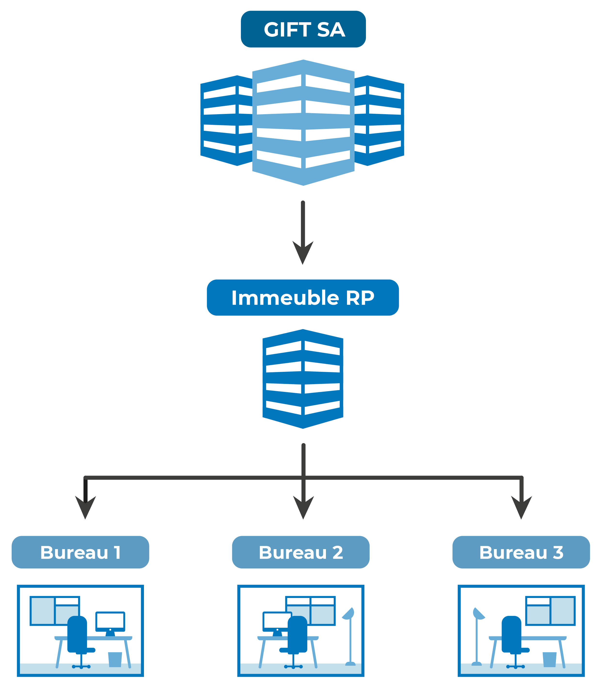
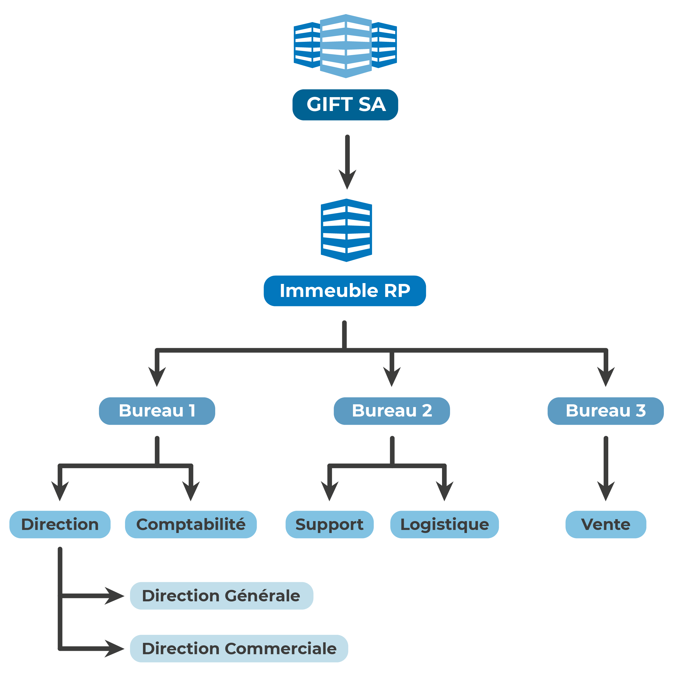
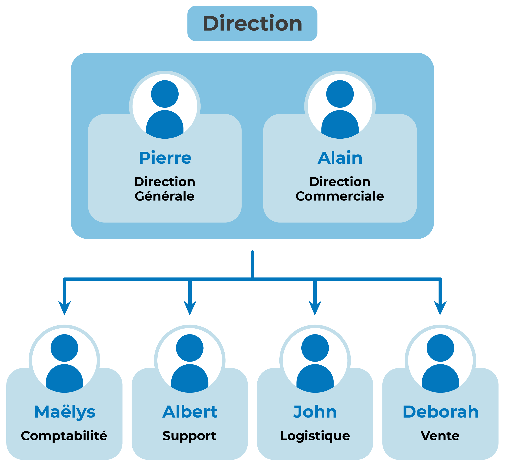
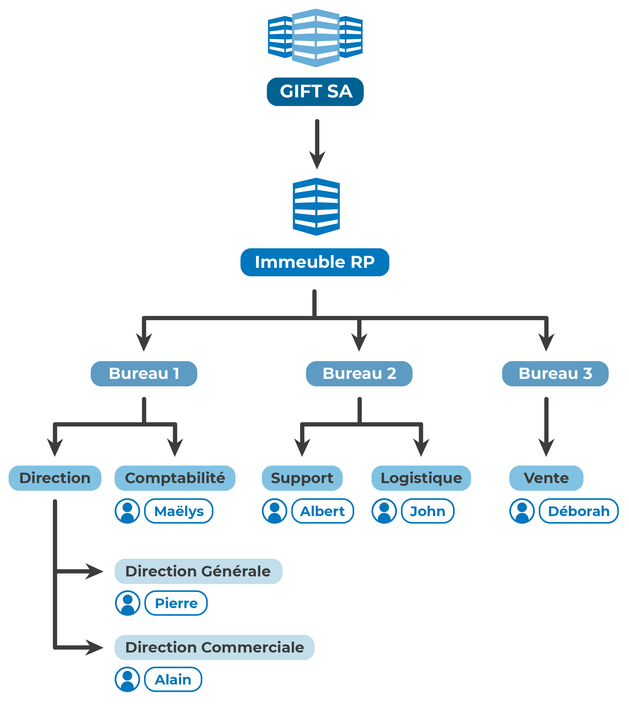
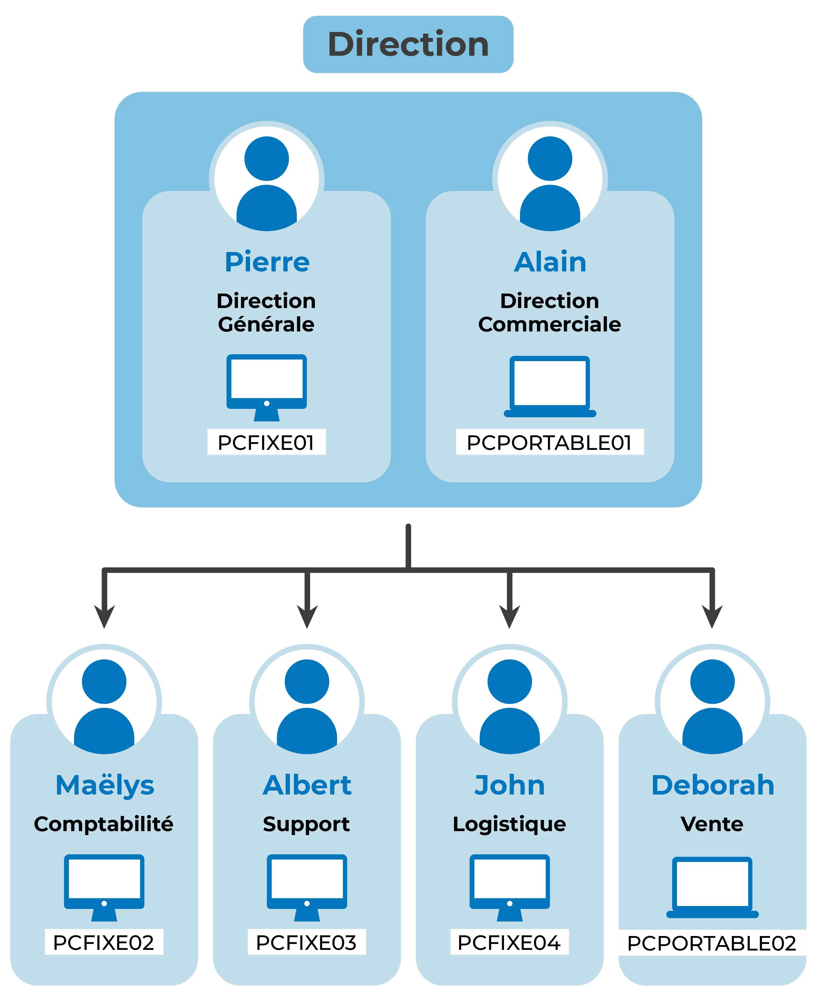
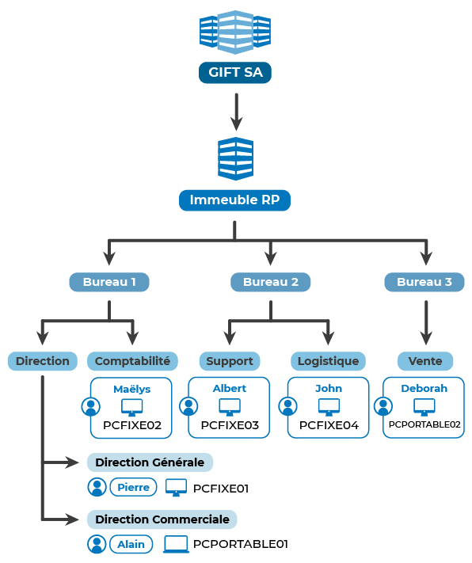
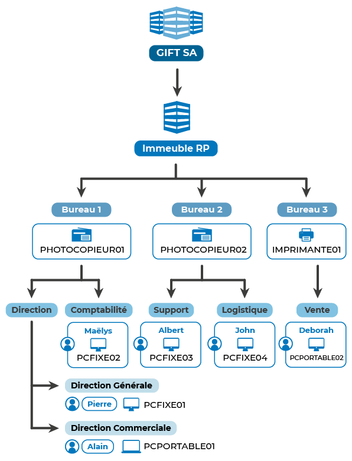
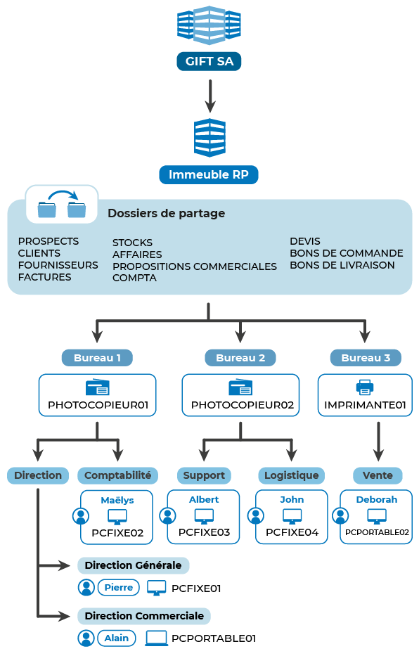

#BTS #2A 

*Ce cours grandement inspiré de l'[excellent](https://openclassrooms.com/fr/courses/2222496-centralisez-et-securisez-votre-annuaire-active-directory) dispensé par OpenClassroom.*

Dans ce chapitre, vous allez apprendre à concevoir les données qui seront au cœur du service **Active Directory** (« l’annuaire » d’entreprise de Microsoft). C'est la phase la plus importante, qui va vous permettre de dimensionner les composantes techniques de l’annuaire permettant de **représenter une entreprise** au sein d’un système d’information.

Active Directory est un annuaire, c'est-à-dire une grosse **base de données**. Il contient les comptes utilisateurs, les machines, les règles de restriction, etc. Pour cette raison, il est indispensable de réfléchir en amont à sa structure et à ce qu’il doit contenir. C’est grâce à ce travail théorique que vous pourrez gérer correctement ensuite votre parc informatique.

## Représentez la hiérarchie de l’entreprise

La conception d’un annuaire de ressources commence par la représentation hiérarchique de l’entreprise. Cette étape est primordiale pour obtenir un annuaire de qualité, correctement organisé et simple d’administration. De plus, cela vous permettra de faciliter les actions de sécurisation que vous allez mettre en œuvre pour, par exemple, sécuriser l’accès aux données.

Pour illustrer ce chapitre, je vous propose de partir de cet exemple. L’entreprise « Gift S.A.» se situe dans un immeuble de la région parisienne. Elle dispose d’un étage entier divisé en 3 bureaux de type « open space » ; dans le premier bureau se trouvent les directions générales et commerciales, ainsi que la comptabilité. Dans le second bureau se trouvent le support et la logistique et enfin, le bureau de la vente sert de salle de réunion lorsque la responsable des ventes est en déplacement chez les clients.

Pour représenter au mieux nos ressources, vous allez les organiser selon la configuration physique réelle :

Cette configuration n’est pas la seule possible, elle va dépendre **de l’entreprise** et de **vos besoins**.

L’entreprise que je vous propose d’étudier est fictive ; libre à vous de prendre un exemple que vous connaissez. Ensuite, vous allez placer les différents services au sein de ces emplacements.

## Représentez les utilisateurs

Je vous propose maintenant de lister **les utilisateurs**. Dans l’exemple que je vous propose, Pierre est le directeur général, Alain le directeur commercial, Maëlys la comptable, John est au support et Déborah à la vente ; enfin, pour finir, Albert à la logistique.

Nous pouvons conclure du suivant :

## Représentez les postes de travail

Comme dans toute entreprise contemporaine, Gift S.A. dispose d’ordinateurs. Qu’ils soient portables ou fixes, je vous propose de les représenter comme nous l’avons fait précédemment, avec la proposition suivante : un PC fixe pour Pierre, Maëlys, John et Albert, et des PC portables pour Alain et Déborah. Nous les représenterons par PCFIXE01, PCFIXE02, PCFIXE03, PCFIXE04 et PCPORTABLE01, PCPORTABLE02.

On obtient alors :

## Représentez les autres équipements

Au sein de Gift S.A., il existe un photocopieur couleur au niveau de la direction, qui est utilisé par les directions générale, commerciale, et la comptabilité. Un second équipement d’impression est disponible pour la logistique uniquement. Enfin, une petite imprimante pour les ventes.

Vous avez maintenant la représentation suivante :

## Identifiez les données

Maintenant que vous avez représenté les ressources (**humaines** et **matérielles**), je vous propose de vous attarder sur les données qui seront traitées. Au sein de notre entreprise fictive, « Gift S.A. », il existe un processus standard de vente, basé sur les types de fichiers suivants :

- Prospects
- Clients
- Fournisseurs
- Stocks
- Affaires
- Propositions commerciales
- Devis 
- Bons de commande
- Bons de livraison
- Factures
- Comptabilité

Pour le moment, l'entreprise Gift S.A. est trop jeune pour avoir un logiciel de gestion intégré ou de planification (ERP, PGI…) ; elle se base uniquement sur des fichiers Word et Excel (comme bon nombre d’entreprises le font).

Il doit donc y avoir des dossiers de partage de ces différents fichiers :

- un dossier PROSPECTS
- un dossier CLIENTS
- un dossier FOURNISSEURS
- un dossier STOCKS
- AFFAIRES
- PROPOSITIONS COMMERCIALES
- DEVIS
- BDC (pour bons de commande)
- BL (pour bons de livraison)
- FACTURES
- et enfin COMPTA

L’objectif de cette représentation est d’**identifier les données** et, comme pour les utilisateurs, de créer des groupes permettant de **simplifier la gestion des droits d’accès**.

Je vous propose d’insérer ces dossiers dans la hiérarchie au sein d’une branche nommée Partages :

