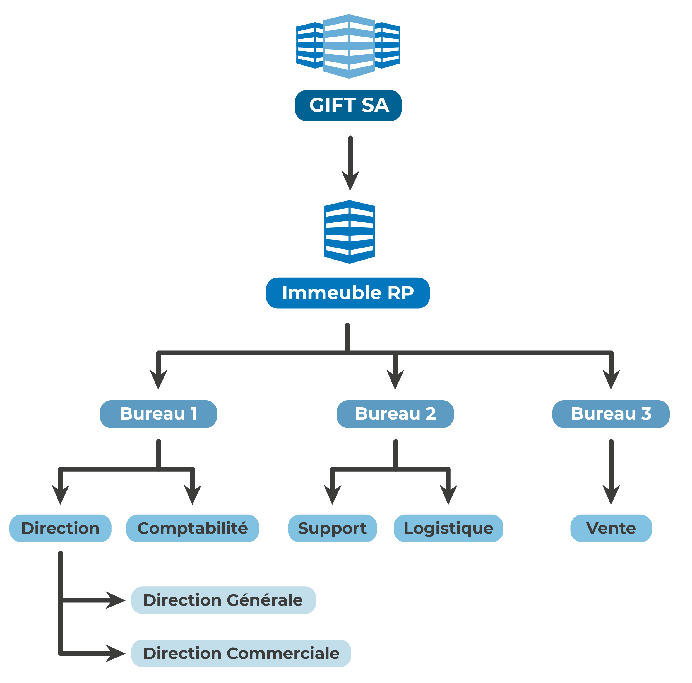
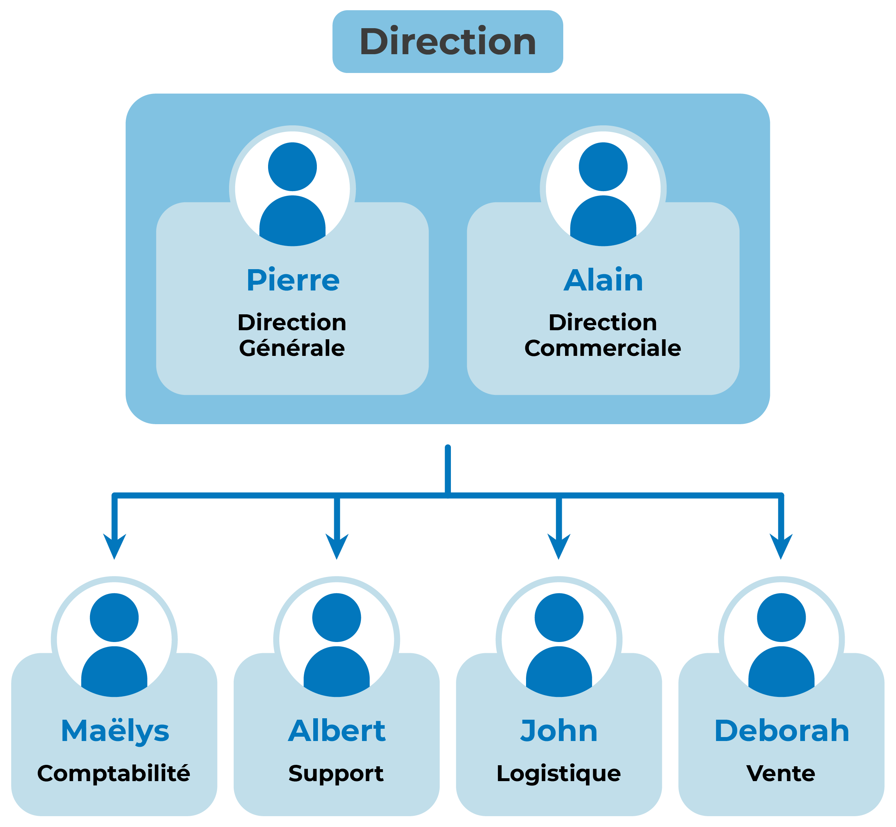
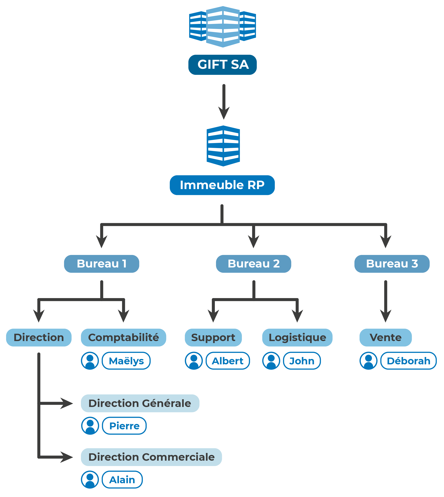
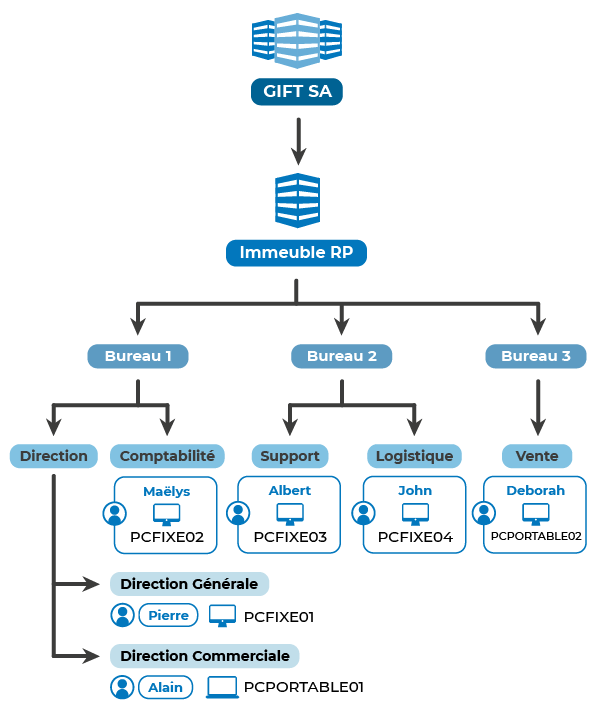
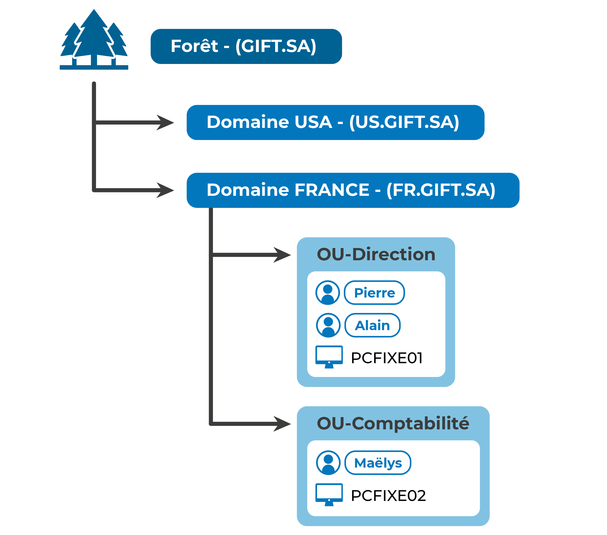
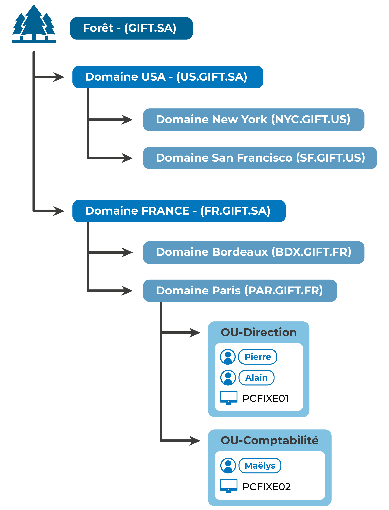
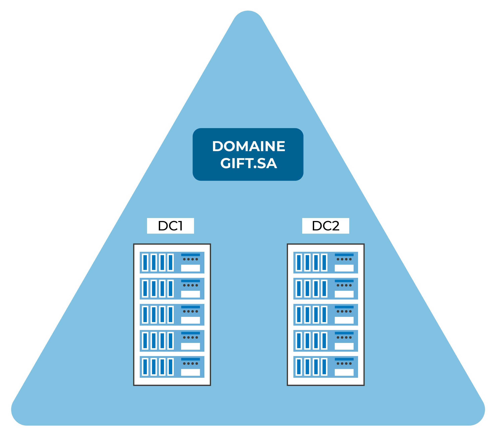
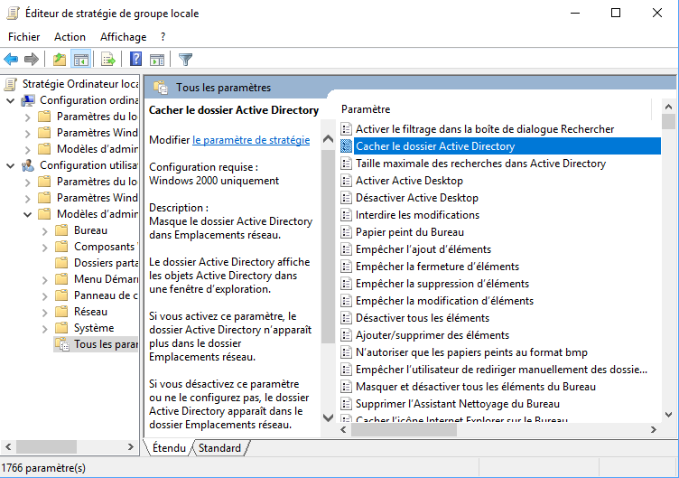

#BTS #2A 

- [Représentez la hiérarchie de l’entreprise](#représentez-la-hiérarchie-de-lentreprise)
- [Représentez les utilisateurs](#représentez-les-utilisateurs)
- [Représentez les postes de travail](#représentez-les-postes-de-travail)
- [Représentez les autres équipements](#représentez-les-autres-équipements)
- [Identifiez les données](#identifiez-les-données)
- [Mise en pratique](#mise-en-pratique)
- [Distinguez les rôles des contrôleurs de domain](#distinguez-les-rôles-des-contrôleurs-de-domain)
- [Les différents objets de l’annuaire](#les-différents-objets-de-lannuaire)
- [Les différents types d’installations](#les-différents-types-dinstallations)
- [Les stratégies de groupes](#les-stratégies-de-groupes)
- [Application des stratégies de groupes](#application-des-stratégies-de-groupes)
- [Paramètres des stratégies de groupes](#paramètres-des-stratégies-de-groupes)

*Ce cours grandement inspiré de l'[excellent](https://openclassrooms.com/fr/courses/2222496-centralisez-et-securisez-votre-annuaire-active-directory) dispensé par OpenClassroom.*

Dans ce chapitre, vous allez apprendre à concevoir les données qui seront au cœur du service **Active Directory** (« l’annuaire » d’entreprise de Microsoft). C'est la phase la plus importante, qui va vous permettre de dimensionner les composantes techniques de l’annuaire permettant de **représenter une entreprise** au sein d’un système d’information.

Active Directory est un annuaire, c'est-à-dire une grosse **base de données**. Il contient les comptes utilisateurs, les machines, les règles de restriction, etc. Pour cette raison, il est indispensable de réfléchir en amont à sa structure et à ce qu’il doit contenir. C’est grâce à ce travail théorique que vous pourrez gérer correctement ensuite votre parc informatique.

## Représentez la hiérarchie de l’entreprise

La conception d’un annuaire de ressources commence par la représentation hiérarchique de l’entreprise. Cette étape est primordiale pour obtenir un annuaire de qualité, correctement organisé et simple d’administration. De plus, cela vous permettra de faciliter les actions de sécurisation que vous allez mettre en œuvre pour, par exemple, sécuriser l’accès aux données.

Pour illustrer ce chapitre, je vous propose de partir de cet exemple. L’entreprise « Gift S.A.» se situe dans un immeuble de la région parisienne. Elle dispose d’un étage entier divisé en 3 bureaux de type « open space » ; dans le premier bureau se trouvent les directions générales et commerciales, ainsi que la comptabilité. Dans le second bureau se trouvent le support et la logistique et enfin, le bureau de la vente sert de salle de réunion lorsque la responsable des ventes est en déplacement chez les clients.

Pour représenter au mieux nos ressources, vous allez les organiser selon la configuration physique réelle :

Cette configuration n’est pas la seule possible, elle va dépendre **de l’entreprise** et de **vos besoins**.

L’entreprise que je vous propose d’étudier est fictive ; libre à vous de prendre un exemple que vous connaissez. Ensuite, vous allez placer les différents services au sein de ces emplacements.

## Représentez les utilisateurs

Je vous propose maintenant de lister **les utilisateurs**. Dans l’exemple que je vous propose, Pierre est le directeur général, Alain le directeur commercial, Maëlys la comptable, John est au support et Déborah à la vente ; enfin, pour finir, Albert à la logistique.

Nous pouvons conclure du suivant :

## Représentez les postes de travail

Comme dans toute entreprise contemporaine, Gift S.A. dispose d’ordinateurs. Qu’ils soient portables ou fixes, je vous propose de les représenter comme nous l’avons fait précédemment, avec la proposition suivante : un PC fixe pour Pierre, Maëlys, John et Albert, et des PC portables pour Alain et Déborah. Nous les représenterons par PCFIXE01, PCFIXE02, PCFIXE03, PCFIXE04 et PCPORTABLE01, PCPORTABLE02.

On obtient alors :

## Représentez les autres équipements

Au sein de Gift S.A., il existe un photocopieur couleur au niveau de la direction, qui est utilisé par les directions générale, commerciale, et la comptabilité. Un second équipement d’impression est disponible pour la logistique uniquement. Enfin, une petite imprimante pour les ventes.

Vous avez maintenant la représentation suivante :

## Identifiez les données

Maintenant que vous avez représenté les ressources (**humaines** et **matérielles**), je vous propose de vous attarder sur les données qui seront traitées. Au sein de notre entreprise fictive, « Gift S.A. », il existe un processus standard de vente, basé sur les types de fichiers suivants :

- Prospects
- Clients
- Fournisseurs
- Stocks
- Affaires
- Propositions commerciales
- Devis 
- Bons de commande
- Bons de livraison
- Factures
- Comptabilité

Pour le moment, l'entreprise Gift S.A. est trop jeune pour avoir un logiciel de gestion intégré ou de planification (ERP, PGI…) ; elle se base uniquement sur des fichiers Word et Excel (comme bon nombre d’entreprises le font).

Il doit donc y avoir des dossiers de partage de ces différents fichiers :

- un dossier PROSPECTS
- un dossier CLIENTS
- un dossier FOURNISSEURS
- un dossier STOCKS
- AFFAIRES
- PROPOSITIONS COMMERCIALES
- DEVIS
- BDC (pour bons de commande)
- BL (pour bons de livraison)
- FACTURES
- et enfin COMPTA

L’objectif de cette représentation est d’**identifier les données** et, comme pour les utilisateurs, de créer des groupes permettant de **simplifier la gestion des droits d’accès**.

Je vous propose d’insérer ces dossiers dans la hiérarchie au sein d’une branche nommée Partages :

## Mise en pratique

Vous avez représentée Gift S.A. de façon hiérarchique ; eh bien Active Directory va vous permettre de faire la même chose, mais de façon **informatisée**.

Une entreprise sera donc représentée par « une forêt » AD. Une forêt est un ensemble de domaines Active Directory qui partagent une structure logique, un schéma de données, une configuration d’annuaire et des fonctionnalités identiques.

Même s’il est très courant de n’avoir qu’un domaine au sein d’une forêt, les entreprises de grande taille vont utiliser ce mode de fonctionnement pour identifier leurs différentes structures, par exemple par pays : fr.gift.sa, us.gift.sa…

Un domaine va représenter une partition d’une forêt (on parle de **partition d’annuaire**) au sein de laquelle vont pouvoir être créés des objets identifiés de manière unique sur le réseau. On parle alors de domaine de sécurité, car il va être possible d’y stocker, entre autres, des identités, des mots de passe ou des certificats.

À l’intérieur de ce domaine de sécurité, vous retrouverez des **unités organisationnelles**. Ce sont des conteneurs qui peuvent, par exemple, représenter les différents services d’une entreprise. À l’intérieur de ces différents conteneurs, vous allez retrouver des **objets**.

Ce sont ces objets qui permettent de représenter les utilisateurs, les imprimantes, les ordinateurs, bref, toutes les ressources d’une entreprise. Enfin, ces objets peuvent être regroupés au sein de **groupes**.

Le principe de domaines multiples au sein d’une forêt permet de segmenter les données au sein d’une entreprise, et donc d’en augmenter la sécurité. Cela permet par exemple d’avoir un domaine pour la filiale France au sein d’une multinationale.

Pour les très grandes multinationales, il est même possible de créer un niveau de hiérarchie supplémentaire avec les arbres qui regroupent un ensemble de domaines. Chacun des arbres faisant partie de la forêt.

## Distinguez les rôles des contrôleurs de domain

Active Directory, comme toute application informatique, est hébergée sur un serveur. Ce serveur porte le nom de contrôleur de domaine. Un contrôleur de domaine héberge les services d’Active Directory nommés Active Directory Domain Services (AD-DS).

AD-DS s’occupe de gérer le stockage des données d’annuaire, de gérer l’authentification et la réplication dans le cas où plusieurs contrôleurs de domaines sont présents.

Pour s’assurer de la cohérence des réplications et de l’unicité des objets, plusieurs rôles doivent être mis en œuvre :

- le rôle de Maître de schéma
- le rôle de Maître d'attribution de noms de domaine  
- le rôle d’Émulateur de Contrôleur de Domaine Principal   
- le rôle de Maître RID    
- le rôle de Maître d'infrastructure.

Chacun de ces cinq rôles permet de réaliser une action particulière au sein de l’annuaire. On les appelle Rôles d'opérations à maître unique flottant, ou plus simplement « rôles FSMO » pour _Flexible Single Master Operation_, et ils permettent de répartir la gestion de l’annuaire sur plusieurs contrôleurs de domaines. Voyons cela dans le détail !

- Le rôle de Maître de schéma (_Schema Master_). Ce rôle contrôle les modifications apportées au schéma de données Active Directory.  

En effet, comme toute base de données, l’Active Directory doit disposer d’un schéma qui permet de définir les différentes informations (attributs) qui vont être associées aux différents types d’objets. Il est primordial qu’il n’y ait qu’un seul et unique Schema Master dans un annuaire, donc dans une forêt AD.

- Le rôle de Maître d'attribution de noms de domaine (_Domain Naming Master_). Ce rôle contrôle l'ajout et la suppression des noms de domaines dans une forêt.

Les noms des domaines au sein d’une forêt doivent être uniques, il convient donc de n’avoir qu’un seul et unique _Domain Naming Master_ dans une forêt.

- Le rôle d’Émulateur de Contrôleur de Domaine Principal (_Primary Domain Controller Emulator_). 

Ce rôle est intéressant, car il permet le support de clients NT4 (Windows NT étant une des premières versions de Windows conçu pour fonctionner en réseau). Il fournit également l'**horloge de référence** du domaine via le protocole NTP.

Une instance de ce rôle est nécessaire par domaine. Ce rôle sera utilisé en priorité pour les différentes requêtes au sein d’un domaine.

- Le rôle de Maître RID (_Registered ID Master_). Ce rôle fournit des tranches d'identifiants uniques aux autres contrôleurs de domaine. 

Le RID est un identifiant unique relatif à un domaine, il fait partie du _SID (Security Identifier)_, ou identifiant de sécurité. Le RID doit être unique afin que le SID soit lui aussi unique, de manière à garantir une identité immuable au sein des réseaux.

C’est sur ces identifiants que Microsoft base l’identification des ressources.

- Maître d'infrastructure (_Infrastructure Master_).

Ce rôle permet de synchroniser les changements effectués sur les objets au sein des différents domaines, en gérant les réplications.

Cette partie, bien que très théorique , est primordiale pour comprendre le fonctionnement d’une forêt AD !

Chaque rôle permet de s’assurer de l’unicité des objets, de leur réplication, d’une unité de temps unique, et des attributs disponibles pour un objet.

N’ayez pas peur, Microsoft a fait en sorte de simplifier ces concepts de façon à permettre une gestion aussi visuelle que possible de vos annuaires !

## Les différents objets de l’annuaire

Vous l’avez compris, il y a différents types d’objets dans un annuaire Active Directory (et dans tout type d’annuaire) :

- les ressources
- les groupes
- et les UO (unités organisationnelles)

Je vous propose d'entrer un peu plus dans leur compréhension.

Les UO, **unités organisationnelles,** ou OU (pour _Organisational Units_) sont les premiers objets d’un annuaire. Ces objets permettent, comme leur nom l’indique, d’organiser et de structurer votre annuaire.

Les **groupes** permettent de simplifier la gestion des ressources en centralisant des objets selon des critères statiques ou dynamiques. Cela permet, par exemple, de regrouper les utilisateurs de la comptabilité devant avoir un accès à des ressources précises.

Les **ressources** sont le cœur de votre annuaire ! Elles permettent de lister les utilisateurs, les imprimantes, les ordinateurs avec plus ou moins d’informations appelées attributs.

Les attributs sont définis par le schéma !

Vous pouvez par exemple définir le nom, le prénom, l’adresse d’un objet utilisateur dans le schéma standard d'AD !

## Les différents types d’installations

Bien, maintenant que vous avez toutes les bases, il ne vous reste plus qu’à vous lancer dans l’installation de votre premier annuaire Active Directory !

En fonction des différents éléments que vous avez vus précédemment, il convient de choisir si vous devez installer une nouvelle forêt avec un ou plusieurs domaines, ou si vous allez juste créer un nouveau domaine au sein d’une forêt existante.

Dans le cas que je vous propose, vous allez créer une nouvelle forêt pour représenter la société Gift S.A. Ce choix est le plus courant, il permet d'avoir un domaine unique, appelé **domaine racine**.

Ce domaine sera réparti sur deux contrôleurs de domaines. Pour le moment, vous n’aurez qu’un seul site. Cette notion de site permet de gérer finement les paramètres de réplication entre les différents contrôleurs de domaines, et est très utile lorsque des sites distants sont reliés avec des connexions à faible débit.

En effet, il est **primordial** de répliquer un annuaire sur au moins deux serveurs, afin de se prémunir des temps de maintenance inhérents à un serveur (mise à jour, sauvegarde, maintenance…) qui pourraient empêcher l’authentification des utilisateurs, ordinateurs ou autres ressources sur un réseau.

## Les stratégies de groupes

Les GPO couvrent l’ensemble des besoins de configuration possibles en entreprise : de la **personnalisation du poste de travail** (fond d’écran, apparence) à la **sécurisation fine** des accès (permission de modifier la configuration IP, de lancer une application ou d’en restreindre l’accès).

Il est même possible d’installer des logiciels et applications grâce à une GPO !

Pour vous y retrouver, Microsoft a mis en œuvre des modèles d’administration. Ces modèles permettent, entre autres, d’avoir des informations sur les possibilités offertes par les GPO.

Au total sur un PC sous Windows 10, plus de 1 700 modèles sont applicables sur un utilisateur, et plus de 2 400 sur un ordinateur.

Vous pouvez les retrouver sur votre PC en lançant la commande gpedit.msc :

## Application des stratégies de groupes

Ces objets s’appliquent au moment de l’**authentification** d’un poste ou d’un utilisateur sur le réseau, puis à intervalles réguliers. Par défaut, cet intervalle varie entre 60 et 120 minutes. Il est possible de configurer cet intervalle de temps grâce… à une stratégie de groupe 😄!

En plus de ces paramètres, une GPO peut être liée à un domaine, un site ou une unité organisationnelle d’un AD.

Par défaut, une GPO s’appliquera à tous les objets authentifiés d’une UO. Il est donc primordial d’en filtrer l’application en fonction de l’appartenance à un groupe. Cela permet de mettre en œuvre de multiples GPO au sein d’un domaine, et même au sein d’une UO.

L’exemple le plus parlant est un ensemble de GPO permettant de gérer la personnalisation de l’apparence d’un ordinateur d’une entreprise :

- application d’un fond d’écran unique 
- durée de mise en veille
- temps de verrouillage de la session utilisateur.

Ces stratégies peuvent être différentes pour les utilisateurs du service Comptabilité et ceux du Support. Ainsi, l’utilisation des groupes devient primordiale.

## Paramètres des stratégies de groupes

Il est possible de faire beaucoup de choses avec des GPO. Je vous conseille de préparer vos **objectifs de sécurisation** avant de vous lancer dans la mise en œuvre des GPO, pour ne pas vous retrouver noyé sous les multiples possibilités offertes par ces objets.

Posez-vous les questions suivantes :

- Est-ce que la stratégie de sécurisation porte sur des utilisateurs ou des ordinateurs ?
- Est-ce que les paramètres que je souhaite appliquer sont :
    - standard (mots de passe, paramètres que vous auriez configurés à la main) ; 
    - ou spécifiques (nécessitant l’installation d’un logiciel tiers) ?
- Est-ce qu’il est intéressant d’appliquer ces paramètres de nombreuses fois ?
- Est-ce un paramètre modifiable par l’utilisateur ?

Ainsi vous serez capable de modéliser votre politique de sécurité, et de concevoir des GPO précises qui vous faciliteront la vie !

Pour terminer et illustrer cela, je vous propose de reprendre l’exemple d’une imprimante. Il pourrait être intéressant que l’imprimante du RDC s’installe automatiquement sur les postes du RDC, non ? Eh bien je vous proposerai, par exemple, de regrouper les ordinateurs du RDC. Vous pourrez identifier ce groupe de la façon suivante : **GDL_O_Ordi_RDC**, et appliquer une GPO sur l’unité organisationnelle RDC.

Pour éviter tout conflit avec les ordinateurs n’ayant pas besoin de l’imprimante, vous pourrez mettre en œuvre **un filtre sur ce groupe uniquement**.

Cette GPO s’occupera d’installer l’imprimante sur les ordinateurs !

